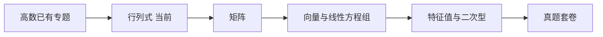

---
title: 2026 数二学习路线
tags:
  - 考研数学/数二
类型: 学习路线
模块: 总览
状态: 进行中
---

# 学习路线

> [!note] 范围说明
> 本路线按近年数学二常见结构建立：高等数学与线性代数。正式复习时以当年考试大纲为准；数学二不含概率论与数理统计。
>
> 数学二也**不考**向量代数与空间解析几何、无穷级数、三重积分与曲线曲面积分（这些属数学一/三），本路线已排除。

## 阶段一：高等数学基础与强化

1. 函数、极限、连续
2. 一元函数微分学与中值定理
3. 一元函数积分学
   - [[高等数学/不定积分|不定积分]]
   - [[高等数学/定积分及其应用|定积分及其应用]]（学习中，暂存）
4. 多元函数微分学
5. [[高等数学/二重积分|重积分：二重积分]]
6. 常微分方程

## 阶段二：线性代数

1. [[线性代数/行列式|行列式]]（当前）与矩阵
2. 向量与线性方程组
3. 特征值、特征向量与相似对角化
4. 二次型

## 阶段三：真题与回炉

1. 分专题限时训练，补齐薄弱前置知识。
2. 真题按年份限时完成，错题回到专题归档。
3. 考前以错题、公式推导和方法选择为主，不重复刷已稳定掌握的机械题。

## 当前节点

当前任务见 [[线性代数/行列式]]，全局进度见 [[学习进度]]。高数专题没有因切换章节而自动标记为已掌握。
