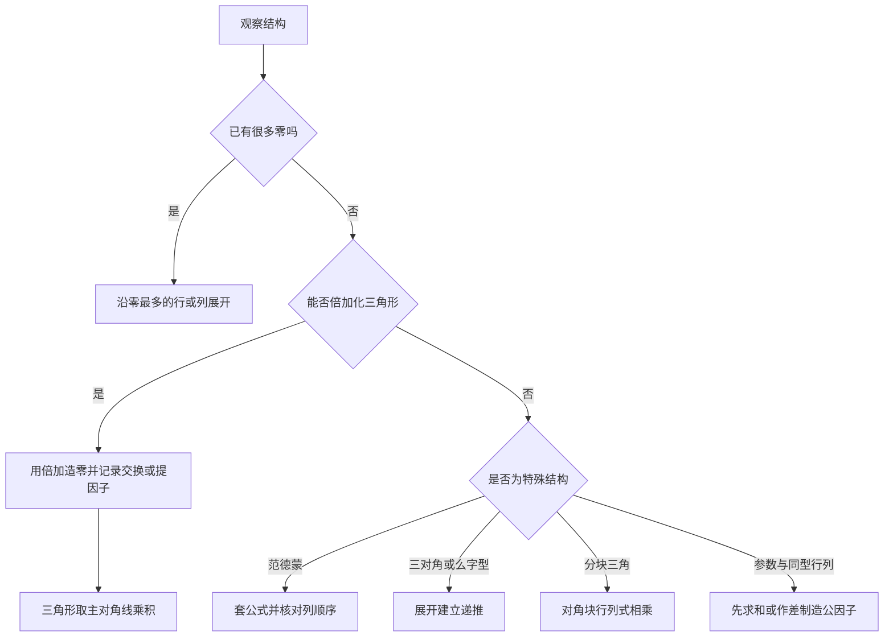

# 行列式

> [!summary] 一句话主线
> **行列式把一个方阵压缩成一个数；计算时的主线不是硬展开，而是利用行列变换“造零”，再按最省事的行或列“降阶”。**

> [!important] 当前状态
> 本页是可脱离聊天记录复习的完整主笔记，不是提纲。内容完整只表示材料已经整理，当前掌握度仍为“待诊断”；完成概念、方法选择和独立计算检测后，才能改为“已检测”或“已掌握”。

> [!note] 两份讲义如何合并
> Kira 讲义负责从方程组动机、定义和性质建立主线；武忠祥讲义补充考研题型通法，尤其是“边化零边展开”、爪形/么形/梭形、加边法、代数余子式和与凑范德蒙。两份讲义的重复内容只保留一套表述。

## 1. 本章在解决什么问题

行列式最初来自线性方程组。对于

$$
\begin{cases}
a_{11}x_1+a_{12}x_2=b_1,\\
a_{21}x_1+a_{22}x_2=b_2,
\end{cases}
$$

消元时自然出现组合

$$
D=a_{11}a_{22}-a_{12}a_{21}
=\begin{vmatrix}
a_{11}&a_{12}\\
a_{21}&a_{22}
\end{vmatrix}.
$$

当 $D\ne0$ 时，方程组有唯一解；为了把这一结构推广到 $n$ 元方程组，就需要定义 $n$ 阶行列式。

行列式在数二线代中的作用可以概括为四条：

1. **计算工具**：把复杂方阵通过性质化为三角形或低阶行列式。
2. **可逆性信号**：后续会证明 $|A|\ne0$ 等价于方阵 $A$ 可逆。
3. **方程组信号**：系数行列式非零时，方程组有唯一解；等于零时还需继续判断，不能直接说“无解”。
4. **后续入口**：特征值由 $|\lambda I-A|=0$ 决定，二次型与相似对角化也会反复使用行列式。

| 前置 | 本章 | 后续 |
|---|---|---|
| 消元、代数运算、简单排列 | 定义、性质、展开、计算 | 矩阵、线性方程组、特征值、二次型 |

## 2. 先建立直觉：它是“有向面积或体积的缩放倍数”

二维向量 $(a,c)^T$ 与 $(b,d)^T$ 张成的平行四边形，其有向面积为

$$
\begin{vmatrix}
a&b\\
c&d
\end{vmatrix}=ad-bc.
$$

- 绝对值 $|ad-bc|$ 是普通面积；
- 正负号反映两列向量的方向次序；
- 两列共线时图形被压扁，面积为 $0$，所以行列式为 $0$；
- 交换两列会改变方向次序，行列式变号。

三阶行列式可理解为三个列向量张成平行六面体的有向体积。更高维虽无法直接画出，但“体积缩放倍数”的逻辑仍成立。

> [!tip] 用几何直觉记性质
> 交换两条方向轴会反向，所以变号；一条方向轴拉长 $k$ 倍，体积变为 $k$ 倍；一条方向与另一条平行，体积塌缩为 $0$。

## 3. 基本概念与定义

### 3.1 行列式、阶数与元素

把 $n^2$ 个数排成 $n$ 行 $n$ 列，并按规定的法则运算，记作

$$
D_n=
\begin{vmatrix}
a_{11}&a_{12}&\cdots&a_{1n}\\
a_{21}&a_{22}&\cdots&a_{2n}\\
\vdots&\vdots&\ddots&\vdots\\
a_{n1}&a_{n2}&\cdots&a_{nn}
\end{vmatrix}
=\det(a_{ij}).
$$

- $D_n$ 称为 $n$ 阶行列式；
- $a_{ij}$ 表示第 $i$ 行第 $j$ 列的元素；
- 行列式的最终结果是一个**数**；
- 行列式只能由方阵定义，没有“三行四列的行列式”。

> [!warning] 行列式不等于矩阵
> 矩阵是一个数表，行列式是对方阵执行运算后得到的标量。书写上矩阵常用圆括号或方括号，行列式用两条竖线。

### 3.2 一阶、二阶与三阶

$$
D_1=\begin{vmatrix}a_{11}\end{vmatrix}=a_{11}.
$$

$$
D_2=
\begin{vmatrix}
a_{11}&a_{12}\\
a_{21}&a_{22}
\end{vmatrix}
=a_{11}a_{22}-a_{12}a_{21}.
$$

三阶行列式可以用对角线法则：

$$
\begin{aligned}
D_3={}&a_{11}a_{22}a_{33}+a_{12}a_{23}a_{31}+a_{13}a_{21}a_{32}\\
&-a_{13}a_{22}a_{31}-a_{12}a_{21}a_{33}-a_{11}a_{23}a_{32}.
\end{aligned}
$$

> [!danger] 对角线法则的边界
> 对角线法则只适用于二阶和三阶行列式。四阶及以上必须用性质、按行列展开或定义法，不能继续“画斜线”。

### 3.3 排列、逆序数与完全展开式

在排列 $j_1j_2\cdots j_n$ 中，若较大的数排在较小的数前面，就构成一个逆序。逆序总数记为 $\tau(j_1j_2\cdots j_n)$。

- $\tau$ 为偶数：偶排列，对应项取正号；
- $\tau$ 为奇数：奇排列，对应项取负号。

$n$ 阶行列式的定义是

$$
D_n=\sum_{j_1j_2\cdots j_n}(-1)^{\tau(j_1j_2\cdots j_n)}
a_{1j_1}a_{2j_2}\cdots a_{nj_n},
$$

求和遍历 $1,2,\ldots,n$ 的全部排列。每一项有三个特征：

1. 从每一行恰取一个元素；
2. 从每一列恰取一个元素；
3. 共有 $n!$ 项，符号由列标排列的奇偶性决定。

定义法通常计算量很大，只有题目中大量元素为 $0$、最终只剩少数非零项，或题目专门询问某一项的符号时才优先使用。

## 4. 余子式、代数余子式与展开定理

### 4.1 两个概念

在 $n$ 阶行列式中，划去元素 $a_{ij}$ 所在的第 $i$ 行和第 $j$ 列，剩余元素按原顺序构成的 $n-1$ 阶行列式称为 $a_{ij}$ 的**余子式**，记为 $M_{ij}$。

$$
A_{ij}=(-1)^{i+j}M_{ij}
$$

称为 $a_{ij}$ 的**代数余子式**。符号按棋盘格排列：

$$
\begin{pmatrix}
+&-&+&\cdots\\
-&+&-&\cdots\\
+&-&+&\cdots\\
\vdots&\vdots&\vdots&\ddots
\end{pmatrix}.
$$

余子式与代数余子式的值都不含 $a_{ij}$ 本身，因此与 $a_{ij}$ 的具体取值无关，只取决于其余元素和位置。

**最小例题：**

$$
D=
\begin{vmatrix}
1&2&3\\
4&5&6\\
7&8&9
\end{vmatrix}.
$$

对 $a_{12}=2$，划去第一行第二列：

$$
M_{12}=\begin{vmatrix}4&6\\7&9\end{vmatrix}=36-42=-6,
\qquad
A_{12}=(-1)^3M_{12}=6.
$$

### 4.2 按行或按列展开

行列式等于任意一行各元素与其代数余子式乘积之和：

$$
D=\sum_{j=1}^n a_{ij}A_{ij}
=a_{i1}A_{i1}+a_{i2}A_{i2}+\cdots+a_{in}A_{in}.
$$

也可按任意一列展开：

$$
D=\sum_{i=1}^n a_{ij}A_{ij}.
$$

**方法选择：**展开前先找零最多的行或列；若没有合适的行列，先用性质造零，再展开降阶。

**代表题：**

$$
\begin{aligned}
D&=\begin{vmatrix}
1&2&3\\
0&1&4\\
5&6&0
\end{vmatrix}\\
&=1\begin{vmatrix}1&4\\6&0\end{vmatrix}
-2\begin{vmatrix}0&4\\5&0\end{vmatrix}
+3\begin{vmatrix}0&1\\5&6\end{vmatrix}\\
&=-24+40-15=1.
\end{aligned}
$$

### 4.3 异行代数余子式乘积和

同一行元素与另一行对应元素的代数余子式乘积之和为 $0$：

$$
\sum_{k=1}^n a_{ik}A_{jk}=0\qquad(i\ne j).
$$

同理，异列也有

$$
\sum_{k=1}^n a_{ki}A_{kj}=0\qquad(i\ne j).
$$

与展开定理合并可记成

$$
\sum_{k=1}^n a_{ik}A_{jk}=\delta_{ij}D,
$$

其中 $\delta_{ij}$ 在 $i=j$ 时为 $1$，在 $i\ne j$ 时为 $0$。其本质是：把第 $j$ 行替换成第 $i$ 行后，若 $i\ne j$ 就出现两行相同，行列式必为 $0$。

### 4.4 代数余子式之和：用系数替换对应行或列

这是武忠祥讲义特别强调的通法。由于 $A_{ij}$ 与 $a_{ij}$ 本身无关，若要求同一行代数余子式的线性组合

$$
S=k_1A_{i1}+k_2A_{i2}+\cdots+k_nA_{in},
$$

就把原行列式第 $i$ 行替换为 $(k_1,k_2,\ldots,k_n)$，再沿第 $i$ 行展开。固定列的组合则替换对应列。

例如，对

$$
D=\begin{vmatrix}
1&2&3\\
0&1&4\\
5&6&0
\end{vmatrix},
$$

有

$$
\begin{aligned}
A_{11}+A_{12}+A_{13}
&=\begin{vmatrix}
1&1&1\\
0&1&4\\
5&6&0
\end{vmatrix}\\
&=-24+20-5=-9.
\end{aligned}
$$

如果题目给的是余子式 $M_{ij}$，必须先用

$$
M_{ij}=(-1)^{i+j}A_{ij}
$$

把系数的正负号改好，再替换行或列。后续学到伴随矩阵后，还可以利用 $AA^*=|A|I$ 处理整组成组的代数余子式；本章先掌握“系数替换”即可。

## 5. 五条核心性质

以下性质对行和列完全对称。做题时必须把“对行成立”自动翻译为“对列也成立”。

### 性质 1：转置不改变行列式

行与列按原顺序互换，行列式值不变：

$$
|A^T|=|A|.
$$

因此只需证明或记忆行性质，列性质可由转置得到。

### 性质 2：交换两行，行列式变号

$$
R_i\leftrightarrow R_j\quad\Longrightarrow\quad D'=-D.
$$

直接推论：

- 两行完全相同，则 $D=0$；
- 两行对应成比例，则 $D=0$；
- 某行全为 $0$，则 $D=0$。

### 性质 3：一行乘 $k$，行列式乘 $k$

$$
R_i\leftarrow kR_i\quad\Longrightarrow\quad D'=kD.
$$

因此某一行有公因子 $k$ 时可以提到行列式外。若 $n$ 阶行列式的**每一行**都乘 $k$，则

$$
|kA|=k^n|A|,
$$

不是 $k|A|$。

### 性质 4：对某一行具有线性性

若某一行写成两个行向量之和，则行列式可以拆成两个行列式之和；其余各行必须保持不变。

$$
\begin{vmatrix}
\vdots\\
\boldsymbol{u}+\boldsymbol{v}\\
\vdots
\end{vmatrix}
=
\begin{vmatrix}
\vdots\\
\boldsymbol{u}\\
\vdots
\end{vmatrix}
+
\begin{vmatrix}
\vdots\\
\boldsymbol{v}\\
\vdots
\end{vmatrix}.
$$

> [!warning] 线性只针对一行或一列
> 一般没有 $|A+B|=|A|+|B|$。如果多行同时写成和，必须逐行拆分，会产生多个行列式。

### 性质 5：一行的倍数加到另一行，值不变

$$
R_j\leftarrow R_j+kR_i\quad(i\ne j)
\quad\Longrightarrow\quad D'=D.
$$

这是计算中最常用的性质，因为它可以免费造零。

| 初等变换 | 行列式如何变化 | 记忆 |
|---|---|---|
| $R_i\leftrightarrow R_j$ | 乘 $-1$ | 交换变号 |
| $R_i\leftarrow kR_i$ | 乘 $k$ | 缩放带因子 |
| $R_j\leftarrow R_j+kR_i$ | 不变 | 倍加免费 |

## 6. 计算总策略：造零、选线、降阶

### 6.1 一般数值型：优先倍加化三角

**代表题：**

$$
D=\begin{vmatrix}
1&2&3\\
2&5&8\\
1&0&1
\end{vmatrix}.
$$

作不改变行列式值的变换

$$
R_2\leftarrow R_2-2R_1,
\qquad
R_3\leftarrow R_3-R_1,
$$

得

$$
D=\begin{vmatrix}
1&2&3\\
0&1&2\\
0&-2&-2
\end{vmatrix}
=\begin{vmatrix}1&2\\-2&-2\end{vmatrix}=2.
$$

这里没有交换和提因子，因此不需要额外修正符号或倍数。

### 6.2 三角行列式

上三角、下三角行列式都等于主对角线元素之积：

$$
D=a_{11}a_{22}\cdots a_{nn}.
$$

次对角线三角形的值为

$$
D=(-1)^{\frac{n(n-1)}2}a_{1n}a_{2,n-1}\cdots a_{n1}.
$$

符号来自把次对角线调到主对角线所需的 $\frac{n(n-1)}2$ 次交换。

### 6.3 参数型：先找相同行和、相同差

计算

$$
D(x)=\begin{vmatrix}
x&1&1\\
1&x&1\\
1&1&x
\end{vmatrix}.
$$

先作 $C_1\leftarrow C_1+C_2+C_3$，得第一列全为 $x+2$，提取公因子：

$$
D(x)=(x+2)
\begin{vmatrix}
1&1&1\\
1&x&1\\
1&1&x
\end{vmatrix}.
$$

再作 $R_2\leftarrow R_2-R_1$、$R_3\leftarrow R_3-R_1$：

$$
D(x)=(x+2)
\begin{vmatrix}
1&1&1\\
0&x-1&0\\
0&0&x-1
\end{vmatrix}
=(x+2)(x-1)^2.
$$

结构信号是：各行元素之和相同，先把所有列加到一列；对角与非对角元素结构相同，再用行差消去公共部分。

### 6.4 列向量线性组合：先拆出重复列

设

$$
D=|C_1,C_2,C_3|=M.
$$

求

$$
D'=|3C_1,4C_1-C_2,-C_3|.
$$

由行列式对列的线性性，

$$
\begin{aligned}
D'&=-3|C_1,4C_1-C_2,C_3|\\
&=-3\left(4|C_1,C_1,C_3|-|C_1,C_2,C_3|\right)\\
&=3M.
\end{aligned}
$$

关键不是把每个元素展开，而是识别重复列行列式为 $0$。

### 6.5 分块三角行列式

若 $A$、$B$ 分别为 $m$ 阶与 $n$ 阶方阵，则

$$
\begin{vmatrix}
A&C\\
O&B
\end{vmatrix}
=
\begin{vmatrix}
A&O\\
C&B
\end{vmatrix}
=|A||B|.
$$

若把两个块行或块列对调，则需要经过 $mn$ 次普通行或列交换，因此会多出因子 $(-1)^{mn}$。

### 6.6 三对角行列式：建立递推

设

$$
D_n=\begin{vmatrix}
2&1&0&\cdots&0\\
1&2&1&\ddots&\vdots\\
0&1&2&\ddots&0\\
\vdots&\ddots&\ddots&\ddots&1\\
0&\cdots&0&1&2
\end{vmatrix}.
$$

按第一行展开：

$$
D_n=2D_{n-1}-D_{n-2}.
$$

初值为 $D_1=2$、$D_2=3$，于是

$$
D_3=4,quad D_4=5,quad\ldots,quad D_n=n+1.
$$

> [!tip] 一切递推题的固定动作
> 先沿首行或末行展开，确认余下部分仍与原行列式同型；再写出递推关系和足够的初值，最后归纳或求递推式。

### 6.7 范德蒙行列式

标准形式为

$$
V_n=\begin{vmatrix}
1&1&\cdots&1\\
x_1&x_2&\cdots&x_n\\
x_1^2&x_2^2&\cdots&x_n^2\\
\vdots&\vdots&\ddots&\vdots\\
x_1^{n-1}&x_2^{n-1}&\cdots&x_n^{n-1}
\end{vmatrix}
=\prod_{1\le i<j\le n}(x_j-x_i).
$$

三阶时

$$
\begin{vmatrix}
1&1&1\\
a&b&c\\
a^2&b^2&c^2
\end{vmatrix}
=(b-a)(c-a)(c-b).
$$

识别信号：第一行全为 $1$，第 $j$ 列是 $1,x_j,x_j^2,\ldots,x_j^{n-1}$。若行序或列序被打乱，必须先调整并记录交换次数；最常见错误是把差的顺序写反。

### 6.8 武忠祥题型通法补充

#### 6.8.1 边化零边展开

不必等到整行或整列全部化好再展开。若一次倍加已经让某个位置出现大量零，就立刻沿该行或列展开，再对降阶后的行列式继续化零。这样数字更小，符号也更容易控制。

#### 6.8.2 爪形、么形与梭形

- **爪形行列式**：非零元素集中在一条主干与若干侧枝上。优先用“中间爪”消去侧爪，目标是化成三角形，而不是按定义硬展开。
- **么形行列式**：非零元素连成“么”形，直接沿“么”的横向稀疏行或列展开。典型结构为

$$
\begin{vmatrix}
a_1&-1&0&\cdots&0\\
a_2&\lambda&-1&\ddots&\vdots\\
a_3&0&\lambda&\ddots&0\\
\vdots&\vdots&\ddots&\ddots&-1\\
a_n&0&\cdots&0&\lambda
\end{vmatrix}
=a_1\lambda^{n-1}+a_2\lambda^{n-2}+\cdots+a_n.
$$

- **梭形行列式**：通常就是主对角线及相邻两条对角线非零的三对角结构，沿首行或末行展开建立递推，见 [[#6.6 三对角行列式：建立递推]]。

这些名称只是帮助识图，真正的方法仍是“找稀疏位置、展开降阶或消元化三角”。

#### 6.8.3 加边法

当各行或各列高度相似，却很难直接提取公因子时，可添加一行一列，把原行列式嵌入更高一阶的行列式，使统一的倍加、作差或分块变得可行。

> [!warning] 加边法不是随意增加阶数
> 必须先写清新行列式与原行列式的等量或倍数关系，再对新行列式变形；若无法通过展开还原到原式，就没有建立有效关系。

#### 6.8.4 凑范德蒙：先提因子、转置或调序

武忠祥讲义中的代表结构不是直接的标准式：

$$
D=\begin{vmatrix}
1&1&1&1\\
2&2^2&2^3&2^4\\
3&3^2&3^3&3^4\\
4&4^2&4^3&4^4
\end{vmatrix}.
$$

从第 $2,3,4$ 行分别提取 $2,3,4$，再转置为标准范德蒙行列式：

$$
\begin{aligned}
D
&=24\begin{vmatrix}
1&1&1&1\\
1&2&3&4\\
1&2^2&3^2&4^2\\
1&2^3&3^3&4^3
\end{vmatrix}\\
&=24\prod_{1\le i<j\le4}(j-i)\\
&=24\cdot12=288.
\end{aligned}
$$

“凑”的固定检查顺序是：能否从行列提幂次因子，能否转置，是否需要调换行列，以及调换后是否漏掉符号。

## 7. 克拉默法则：理解用途，不把它当主计算法

对二元方程组

$$
\begin{cases}
a_{11}x_1+a_{12}x_2=b_1,\\
a_{21}x_1+a_{22}x_2=b_2,
\end{cases}
$$

令

$$
D=\begin{vmatrix}a_{11}&a_{12}\\a_{21}&a_{22}\end{vmatrix},
\quad
D_1=\begin{vmatrix}b_1&a_{12}\\b_2&a_{22}\end{vmatrix},
\quad
D_2=\begin{vmatrix}a_{11}&b_1\\a_{21}&b_2\end{vmatrix}.
$$

当 $D\ne0$ 时，

$$
x_1=\frac{D_1}{D},\qquad x_2=\frac{D_2}{D}.
$$

**例：**

$$
\begin{cases}
2x+y=5,\\
x-y=1.
\end{cases}
$$

有

$$
D=-3,qquad D_1=-6,qquad D_2=-3,
$$

所以 $x=2$、$y=1$。

> [!warning] $D=0$ 时不能直接下结论
> 克拉默法则只说明 $D\ne0$ 时有唯一解。若 $D=0$，方程组可能无解，也可能有无穷多解，需在“线性方程组”章节继续判断。

## 8. 题目结构到方法的选择

| 结构信号 | 首选动作 | 目标 |
|---|---|---|
| 某行或列零很多 | 直接沿该行或列展开 | 降阶 |
| 一般数值行列式 | 倍加造零，化为三角形 | 对角线乘积 |
| 两行相同或成比例 | 直接判 $0$ | 避免无效计算 |
| 一行有公因子 | 先提公因子 | 简化数字 |
| 各行和相同 | 把所有列加到一列 | 提公共因子 |
| 各列具有 $1,x,x^2,\ldots$ | 范德蒙公式 | 一步写乘积 |
| 三对角或“么字型” | 首行或末行展开 | 建递推 |
| 分块上三角或下三角 | 对角块行列式相乘 | 分块降维 |
| 大量元素为 $0$ 且问定义项 | 完全展开式 | 保留少数非零项 |
| 出现代数余子式乘积和 | 同行展开得 $D$，异行替换得 $0$ | 套统一恒等式 |
| 出现代数余子式线性组合 | 用系数替换对应行或列 | 化为同阶行列式 |
| 爪形、么形、梭形 | 消侧爪、沿横展开、建立递推 | 利用稀疏结构 |
| 接近范德蒙但幂次或方向不标准 | 提因子、转置、调序 | 凑标准范德蒙 |
| 各行列高度相似但难直接消元 | 考虑加边法 | 统一变换或分块 |

## 9. 高频易错点与防坑清单

1. **对象混淆**：行列式是数，矩阵是表；非方阵没有行列式。
2. **三阶规则越界**：四阶不能用对角线法则。
3. **代数余子式漏符号**：先写 $A_{ij}=(-1)^{i+j}M_{ij}$，不要凭感觉判正负。
4. **交换后忘记变号**：每交换一次行或列乘 $-1$。
5. **提因子范围错误**：从一行提 $k$，行列式外只有一个 $k$；每行都提才是 $k^n$。
6. **把倍加和数乘混为一谈**：$R_j\leftarrow R_j+kR_i$ 不变；$R_j\leftarrow kR_j$ 会乘 $k$。
7. **滥用加法**：一般 $|A+B|\ne|A|+|B|$，线性只针对单独一行或一列。
8. **见 $D=0$ 就说无解**：只能说明不满足唯一解条件，仍需判断秩或继续消元。
9. **范德蒙差的方向写反**：按列参数从左到右写 $x_j-x_i$，交换列要同步变号。
10. **递推漏初值**：二阶递推至少需要两个初值，否则无法唯一确定结果。
11. **余子式与代数余子式混用**：替换行列前先确认题目给的是 $M_{ij}$ 还是 $A_{ij}$；二者相差棋盘符号。

## 10. 预习诊断

先独立完成，不看后面的学习中答疑。作答时不仅给结果，还要说明为什么选择该方法。

### 诊断 1：概念与性质

判断并说明理由：

1. 三行四列的数表也可以求行列式。
2. 若某个三阶行列式为 $0$，对应三元方程组一定无解。
3. $R_2\leftarrow R_2-3R_1$ 不改变行列式值，而 $R_2\leftarrow3R_2$ 会改变行列式值。
4. 代数余子式 $A_{ij}$ 的值与元素 $a_{ij}$ 本身无关。

### 诊断 2：独立计算

不用三阶对角线法则，计算

$$
D=\begin{vmatrix}
1&1&1\\
1&2&3\\
1&4&9
\end{vmatrix}.
$$

要求写出每一步行变换，并说明行列式值是否改变。

### 诊断 3：方法选择

对

$$
D_n=\begin{vmatrix}
2&1&0&\cdots&0\\
1&2&1&\ddots&\vdots\\
0&1&2&\ddots&0\\
\vdots&\ddots&\ddots&\ddots&1\\
0&\cdots&0&1&2
\end{vmatrix},
$$

你会选择“定义法、化三角、按行展开递推、范德蒙公式”中的哪一种？只需说明识别线索，并写出第一步。

再写出 $2A_{11}-A_{12}+3A_{13}$ 应转化成怎样的同阶行列式，不必计算。

## 11. 学习中补充

> [!todo] 等待真实问题
> 后续只有在你明确说“补入笔记”或“记录到笔记”时，才在这里按“问题 - 原因 - 最小例题 - 防坑结论”记录，并同步到 [[学习记录/行列式-学习记录]]。普通答疑默认只在聊天中进行。

## 12. 最终自检

- [ ] 能解释行列式与矩阵的区别，并说明为什么只有方阵才有行列式。
- [ ] 能从二元方程组消元或面积缩放解释二阶行列式的意义。
- [ ] 能写出 $M_{ij}$、$A_{ij}$ 的定义并正确处理棋盘符号。
- [ ] 能沿任意行或列展开，并主动选择零最多的行或列。
- [ ] 能准确说出三种初等行变换对行列式值的影响。
- [ ] 能识别相同行、比例行、零行并直接判定行列式为 $0$。
- [ ] 能把一般数值行列式通过倍加化为三角形，且不漏交换符号和提取因子。
- [ ] 能识别参数型的相同行和、行差结构并制造公因子。
- [ ] 能识别范德蒙、分块三角和三对角递推三类特殊结构。
- [ ] 能说明 $D\ne0$ 与方程组唯一解的关系，并知道 $D=0$ 时不能直接判无解。
- [ ] 能解释同行代数余子式乘积和为何为 $D$、异行为何为 $0$。
- [ ] 能把代数余子式的线性组合转化为“系数替换对应行或列”的同阶行列式。
- [ ] 能识别爪形、么形、梭形与需要凑范德蒙的结构，并说出第一步动作。
- [ ] 能独立完成一道综合计算，并说出“结构信号 -> 方法 -> 防坑点”。

## 13. 来源与后续安排

- 主线资料：Kira《27考研线代基础讲义&习题》第一章“行列式”，书内第 3-15 页，对应 PDF 第 7-19 页。
- 方法补充：武忠祥《2027考研数学-线代概率核心基础》第 1 讲“行列式”，书内第 3-22 页，对应 PDF 第 6-25 页。
- 综合覆盖：行列式概念、二三阶计算、余子式与代数余子式、按行列展开、五条性质、化零降阶、三角与分块行列式、参数型、递推、范德蒙、完全展开式、异行代数余子式关系，以及边化零边展开、爪形/么形/梭形、加边法、系数替换和凑范德蒙。
- 资料定位与后续读取规则见 [[资料/线性代数讲义阅读索引]]。

完成预习诊断后，根据实际卡点逐个学习；只有在概念解释、方法选择、独立计算和变式判断均有证据时，才进入掌握检测。检测通过后按第 1、3、7、14 天安排复习。
