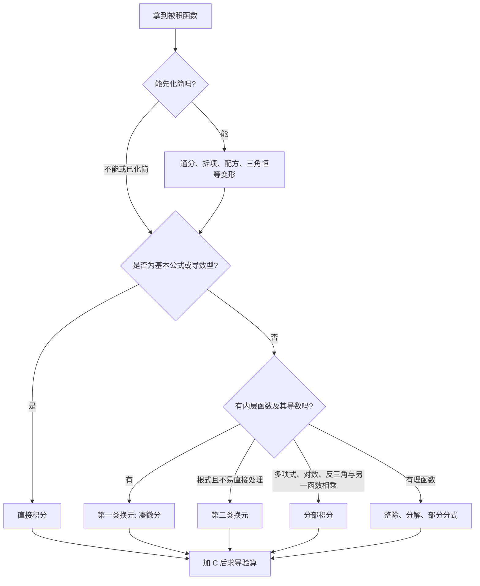

# 不定积分复习清单

> [!summary] 核心路线
> **先化简，再识别结构，后选方法，最后求导验算。** 不定积分不是“套公式比赛”，而是把被积函数重新识别成某个导数。

本页综合两份讲义第四章的不定积分部分：基本公式、两类换元、分部积分、有理函数积分和分段函数原函数。重点补充考场上的选法、验算和易错边界。

## 1. 概念与底线

若在区间 $I$ 上

$$
F'(x)=f(x),
$$

则 $F(x)$ 是 $f(x)$ 的一个原函数，所有原函数组成的不定积分：

$$
\boxed{\int f(x)\,dx=F(x)+C}.
$$

- $C$ 必须写，因为常数求导为 $0$；
- 最终答案的唯一硬核验算：**对答案求导，必须回到被积函数**；
- 积分变量只是哑变量：$\int f(x)dx=\int f(t)dt$；
- 线性性成立，但乘法、除法没有对应的“积分法则”。
- 连续函数在区间上一定有原函数；反过来，存在原函数的函数不一定连续。

$$
\int[af(x)+bg(x)]dx=a\int f(x)dx+b\int g(x)dx.
$$

> [!warning] 两个绝对不能写的式子
> $\int f(x)g(x)dx\ne\left(\int f(x)dx\right)\left(\int g(x)dx\right)$；
> $\int\frac{f(x)}{g(x)}dx\ne\frac{\int f(x)dx}{\int g(x)dx}$。

## 2. 考场 15 秒选法

## 3. 必背基本积分表

### 3.1 代数、指数、对数

| 被积函数 | 不定积分 | 条件或提醒 |
|---|---|---|
| $x^\alpha$ | $\dfrac{x^{\alpha+1}}{\alpha+1}+C$ | $\alpha\ne-1$ |
| $1/x$ | $\ln\lvert x\rvert+C$ | 绝对值不能漏 |
| $e^x$ | $e^x+C$ |  |
| $a^x$ | $\dfrac{a^x}{\ln a}+C$ | $a>0,\ a\ne1$ |
| $\dfrac{f'(x)}{f(x)}$ | $\ln\lvert f(x)\rvert+C$ | 先查分子是否为分母导数 |
| $\dfrac{f'(x)}{1+[f(x)]^2}$ | $\arctan f(x)+C$ | 复合反三角型 |
| $\dfrac{f'(x)}{\sqrt{1-[f(x)]^2}}$ | $\arcsin f(x)+C$ | 根号内需对应 |

### 3.2 三角与反三角

| 被积函数 | 不定积分 |
|---|---|
| $\sin x$ | $-\cos x+C$ |
| $\cos x$ | $\sin x+C$ |
| $\sec^2x$ | $\tan x+C$ |
| $\csc^2x$ | $-\cot x+C$ |
| $\sec x\tan x$ | $\sec x+C$ |
| $\csc x\cot x$ | $-\csc x+C$ |
| $\tan x$ | $-\ln\lvert\cos x\rvert+C$ |
| $\cot x$ | $\ln\lvert\sin x\rvert+C$ |
| $\sec x$ | $\ln\lvert\sec x+\tan x\rvert+C$ |
| $\csc x$ | $\ln\lvert\csc x-\cot x\rvert+C$ |
| $\dfrac1{1+x^2}$ | $\arctan x+C$ |
| $\dfrac1{\sqrt{1-x^2}}$ | $\arcsin x+C$ |

### 3.3 见到就该认出的常数变形

设 $a>0$：

$$
\int\frac{dx}{x^2+a^2}=\frac1a\arctan\frac xa+C,
$$

$$
\int\frac{dx}{\sqrt{a^2-x^2}}=\arcsin\frac xa+C.
$$

另外两类常见分母的对数型结果为

$$
\int\frac{dx}{a^2-x^2}
=\frac1{2a}\ln\left|\frac{a+x}{a-x}\right|+C,
$$

$$
\int\frac{dx}{x^2-a^2}
=\frac1{2a}\ln\left|\frac{x-a}{x+a}\right|+C.
$$

根式中还有两类对数型结果：

$$
\int\frac{dx}{\sqrt{x^2+a^2}}
=\ln\left|x+\sqrt{x^2+a^2}\right|+C,
$$

$$
\int\frac{dx}{\sqrt{x^2-a^2}}
=\ln\left|x+\sqrt{x^2-a^2}\right|+C.
$$

### 3.4 根式的常用积分

下面三式是根式积分中最常用的标准结果；遇到二次式时先配方，再与它们对照。常数 $a>0$。

$$
\boxed{\int\sqrt{1-x^2}\,dx
=\frac{x}{2}\sqrt{1-x^2}+\frac12\arcsin x+C}
\qquad(-1\le x\le1).
$$

它的含参数形式为

$$
\int\sqrt{a^2-x^2}\,dx
=\frac{x}{2}\sqrt{a^2-x^2}
+\frac{a^2}{2}\arcsin\frac{x}{a}+C
\qquad(|x|\le a).
$$

另外两类高频根式为

$$
\int\sqrt{x^2+a^2}\,dx
=\frac{x}{2}\sqrt{x^2+a^2}
+\frac{a^2}{2}\ln\left|x+\sqrt{x^2+a^2}\right|+C,
$$

$$
\int\sqrt{x^2-a^2}\,dx
=\frac{x}{2}\sqrt{x^2-a^2}
-\frac{a^2}{2}\ln\left|x+\sqrt{x^2-a^2}\right|+C.
$$

> [!tip] 记忆与验算
> 前两项都先写成 $\dfrac{x}{2}\times\text{原根式}$；$a^2-x^2$ 配 $+\arcsin(x/a)$，$x^2+a^2$ 配 $+\ln$，$x^2-a^2$ 配 $-\ln$。不确定符号时，直接对结果求导验算。

## 4. 化简优先：不化简常常看不出方法

### 三角恒等变形

$$
\sin^2x=\frac{1-\cos2x}{2},\qquad
\cos^2x=\frac{1+\cos2x}{2},
$$

$$
\sin x\cos x=\frac12\sin2x.
$$

### 三角幂函数的降幂规则

对 $\sin^m x\cos^n x$：

- 某个幂为奇数：留下一个对应的 $\sin x$ 或 $\cos x$，其余用 $1-\cos^2x$ 或 $1-\sin^2x$ 化掉；
- 两个幂都为偶数：用半角公式逐次降幂。

对 $\tan^m x\sec^n x$：

- $n$ 为正偶数：留一个 $\sec^2x$，其余用 $\sec^2x=1+\tan^2x$；
- $m$ 为正奇数：留一个 $\sec x\tan x$，其余用 $\tan^2x=\sec^2x-1$。

### 常用拆项

$$
\frac{P'(x)}{P(x)}\longrightarrow\ln|P(x)|,
$$

$$
\frac1{x(x+1)}=\frac1x-\frac1{x+1}.
$$

> [!tip] 先问一句
> 能否把题目化成“某个东西的导数”乘“某个函数”？能做到时，通常比强行分部或三角代换短得多。

## 5. 第一类换元：凑微分

**识别信号：**出现 $f(\varphi(x))\varphi'(x)$，或只差一个常数倍。

$$
\int f[\varphi(x)]\varphi'(x)\,dx=\int f(u)\,du,\qquad u=\varphi(x).
$$

**写法：**令 $u=$ 内层，写 $du=$ 什么；把 $dx$ 和系数完整替换；积分后换回 $x$。

**典型结构：**

| 结构 | 凑出的微分 |
|---|---|
| $f(ax+b)$ | $d(ax+b)=a\,dx$ |
| $f(\sin x)\cos x$ | $d(\sin x)$ |
| $f(\cos x)\sin x$ | $-d(\cos x)$ |
| $f(\tan x)\sec^2x$ | $d(\tan x)$ |
| $f(\ln x)/x$ | $d(\ln x)$ |
| $x^{n-1}f(x^n)$ | $d(x^n)/n$ |

**例：**

$$
\int\frac{2x}{x^2+1}dx
=\int\frac{d(x^2+1)}{x^2+1}
=\ln(x^2+1)+C.
$$

## 6. 第二类换元：根式的备用工具

先尝试配方、拆分或凑微分；确实无法直接处理时，再主动代换。

| 根式形状 | 常用代换 | 化简结果 |
|---|---|---|
| $\sqrt{a^2-x^2}$ | $x=a\sin t$ | $a\cos t$ |
| $\sqrt{x^2+a^2}$ | $x=a\tan t$ | $a\sec t$ |
| $\sqrt{x^2-a^2}$ | $x=a\sec t$ | $a\tan t$ |

二次式先配方。例如先把 $x^2-2x+5$ 写成 $(x-1)^2+4$，再决定如何代换。

当被积函数同时含 $x$ 与 $1/x$，或根式中出现 $1/x$，也要尝试倒代换 $t=1/x$；它常能先把式子化为有理函数或标准根式。

## 7. 分部积分：让后一个积分更简单

$$
\boxed{\int u\,dv=uv-\int v\,du}.
$$

选 $u$、$dv$ 的标准不是背口诀，而是检查 $\int v\,du$ 是否更简单。

- 有 $\ln x$、反三角函数：通常取为 $u$；
- 多项式乘 $e^{ax}$、$\sin ax$、$\cos ax$：通常令多项式为 $u$，使其降次；
- “反对幂指三”可作候选顺序：反三角、对数、幂、指数、三角。

**例：**

$$
\int x e^x dx=xe^x-\int e^x dx=(x-1)e^x+C.
$$

### 7.1 表格积分法（DI 法）

表格积分法不是新公式，而是把分部积分连续做多次，改用表格记录。它适合：

$$
\text{多项式}\times e^{ax},\qquad
\text{多项式}\times\sin ax,\qquad
\text{多项式}\times\cos ax.
$$

原因是：左边的多项式不断求导，最终会变成 $0$；右边不断求原函数始终简单。

**操作规则：**左列反复求导，右列反复积分；符号从 $+$ 开始交替；沿对角线相乘后按符号相加；左列变为 $0$ 时停止。

**例 1：**

$$
\int x^2e^x\,dx.
$$

| 符号 | 左列：不断求导 | 右列：不断积分 |
|---|---:|---:|
| $+$ | $x^2$ | $e^x$ |
| $-$ | $2x$ | $e^x$ |
| $+$ | $2$ | $e^x$ |
|  | $0$ |  |

沿对角线相乘：

$$
\int x^2e^x\,dx
=x^2e^x-2xe^x+2e^x+C.
$$

**例 2：**

$$
\int x\sin x\,dx.
$$

| 符号 | 左列：不断求导 | 右列：不断积分 |
|---|---:|---:|
| $+$ | $x$ | $-\cos x$ |
| $-$ | $1$ | $-\sin x$ |
|  | $0$ |  |

因此

$$
\int x\sin x\,dx
=x(-\cos x)-1(-\sin x)+C
=-x\cos x+\sin x+C.
$$

> [!warning] 什么时候不能直接用表格法
> 左列求导必须能在有限步后变为 $0$。例如 $\int e^x\sin x\,dx$ 中，$e^x$ 和 $\sin x$ 无论怎么求导都不会归零；这类题连续两次分部后会回到原积分，应设原积分为 $I$ 再移项。

> [!note] 循环型积分
> $\int e^{ax}\sin bx\,dx$、$\int e^{ax}\cos bx\,dx$ 连续两次分部后会重新出现原积分。把原积分设为 $I$，移项解 $I$，不要无限重复分部。

### 7.2 指数与三角函数的循环型积分

下面两式是连续两次分部积分并移项后的结果，行列式只是一种便于记忆的写法，不是另一种积分方法。这里 $a^2+b^2\ne0$。

$$
\int e^{ax}\sin bx\,dx
=\frac1{a^2+b^2}
\begin{vmatrix}
(e^{ax})' & (\sin bx)'\\
e^{ax} & \sin bx
\end{vmatrix}+C
=\frac{e^{ax}(a\sin bx-b\cos bx)}{a^2+b^2}+C.
$$

$$
\int e^{ax}\cos bx\,dx
=\frac1{a^2+b^2}
\begin{vmatrix}
(e^{ax})' & (\cos bx)'\\
e^{ax} & \cos bx
\end{vmatrix}+C
=\frac{e^{ax}(a\cos bx+b\sin bx)}{a^2+b^2}+C.
$$

> [!tip] 考场用法
> 若能直接写出上式，可以直接使用；若一时记不准符号，设原积分为 $I$，连续分部两次后解出 $I$ 更稳。最后对答案求导即可验符号。

## 8. 有理函数、三角有理式与分段函数

### 8.1 有理函数 $P(x)/Q(x)$

1. 分子次数不低于分母：先多项式除法；
2. 分母能分解：先分解；
3. 真分式：部分分式分解；
4. 再回到基本积分或导数型。

常见分解轮廓：

$$
\frac{P(x)}{(x-a)(x-b)}=\frac A{x-a}+\frac B{x-b},
$$

重复一次因子必须逐幂列全：

$$
\frac{P(x)}{(x-a)^m}
=\frac{A_1}{x-a}+\frac{A_2}{(x-a)^2}+\cdots+\frac{A_m}{(x-a)^m}.
$$

不可约二次因子 $(x^2+px+q)^m$ 对应的每一层分子都应设为一次式 $Ax+B$。

尤其对

$$
\int\frac{Ax+B}{x^2+px+q}dx,
$$

先把分子拆成

$$
Ax+B=\lambda(2x+p)+\mu.
$$

前一部分直接给出 $\lambda\ln|x^2+px+q|$；后一部分再对分母配方，化为反正切型或对数型。不要一看到二次分母就直接套部分分式。

### 8.2 三角有理式

先用基本恒等式、凑微分或降幂。只有一般的 $R(\sin x,\cos x)$ 确实无路可走时，才用

$$
t=\tan\frac x2
$$

把它化为有理函数。具体地，

$$
\sin x=\frac{2t}{1+t^2},\qquad
\cos x=\frac{1-t^2}{1+t^2},\qquad
dx=\frac{2}{1+t^2}dt.
$$

这是保底工具，不是默认首选。

### 8.3 分段函数的原函数

先在每个分段内分别积分，积分常数要用不同字母；再利用原函数的连续性确定这些常数之间的关系。不能把不同分段的常数一开始就强行写成同一个 $C$。

## 9. 高频易错点

| 错误 | 正确做法 |
|---|---|
| 漏写 $+C$ | 不定积分必须写积分常数 |
| $\int1/x\,dx=\ln x+C$ | 写 $\ln\lvert x\rvert+C$ |
| 换元后不换回 $x$ | 最终答案回到原变量 |
| 只写 $u=\varphi(x)$，不处理 $du$ | 系数和 $dx$ 必须完整替换 |
| 分部积分后更复杂仍继续 | 重选 $u,dv$，目标是简化 $\int vdu$ |
| 根式一律三角代换 | 先化简、配方、凑微分 |
| 算完不验算 | 最后求导一次 |

## 10. 复习清单

- [ ] 能说清原函数与不定积分的区别，并解释 $+C$。
- [ ] 能写对幂函数、$1/x$、指数、三角和反三角基本积分。
- [ ] 看到 $f'(x)/f(x)$、$f'(x)/(1+f^2)$、$f'(x)/\sqrt{1-f^2}$ 能立即识别。
- [ ] 能先化简三角平方、乘积和简单分式。
- [ ] 能判断何时使用凑微分、分部积分、根式代换、部分分式。
- [ ] 能说明分部积分中 $u,dv$ 的选择理由。
- [ ] 能处理分段函数积分常数之间的关系。
- [ ] 每道题都能用“求导”完成验算。

## 11. 自测题

1. $\displaystyle\int(3x^2-4x+1)dx$
2. $\displaystyle\int\frac{x^3}{1+x^4}dx$
3. $\displaystyle\int x\ln x\,dx$
4. $\displaystyle\int\sin^2x\,dx$
5. $\displaystyle\int\frac{dx}{x^2+4}$

> [!example]- 答案
> 1. $x^3-2x^2+x+C$。
> 2. $\frac14\ln(1+x^4)+C$。
> 3. $\frac{x^2}{2}\ln x-\frac{x^2}{4}+C$。
> 4. $\frac x2-\frac{\sin2x}{4}+C$。
> 5. $\frac12\arctan\frac x2+C$。

## 12. 知识连接

| 前置 | 本专题 | 后续 |
|---|---|---|
| [[微分总结]]：导数、链式法则、微分 | 不定积分：反向求导与结构识别 | 定积分、牛顿-莱布尼茨公式、微分方程 |

参考讲义：`【一高数Kira】27考研高数基础讲义.pdf` 第四章；`27汤家凤《高数辅导讲义》基础篇.pdf` 第四章（书内第 73 页起）。

## 13. 880 题型补充

880 第三章 PDF 第 40–41 页的不定积分题刻意把有理式、根式、三角式、绝对值和分部积分并排放置。第一眼不必猜答案，而要先按“**能否化简 - 是否有内层导数 - 是否降阶**”做结构分流。

### 13.1 有理函数：先判真分式，后谈部分分式

**题干信号：** 分子、分母都是多项式。

**标准步骤：**

1. 若分子次数不低于分母，先多项式除法；
2. 分母因式分解为一次因子和不可约二次因子；
3. 按因子类型设部分分式，再比较系数；
4. 一次因子给 $\ln|x-a|$，二次因子先凑导数再余下反正切型。

例如看到

$$
\int\frac{2x+1}{x^2+x+1}\,dx,
$$

先写 $2x+1=(2x+1)$，恰是分母导数，直接为 $\ln(x^2+x+1)+C$；若分子不是完整导数，再拆成“分母导数部分 + 常数部分”。不要一见分式就机械设一大串部分分式。

### 13.2 根式：先让根号变成平方，再选代换

**题干信号：** $\sqrt{a^2-x^2}$、$\sqrt{x^2-a^2}$、$\sqrt{x^2+a^2}$ 或可配成这三类（880 第 40 页）。

**方法选择：**

$$
\sqrt{a^2-x^2}:x=a\sin t;\qquad
\sqrt{x^2-a^2}:x=a\sec t;\qquad
\sqrt{x^2+a^2}:x=a\tan t.
$$

代换前先看分子是否已经含 $x\,dx$：有时令 $u=x^2\pm a^2$ 更短。三角代换的目的不是背表，而是使根号成为 $a\cos t$、$a\tan t$ 或 $a\sec t$ 这种可积分的形式。

### 13.3 三角和绝对值：化简、分段优先于换元

**题干信号：** 三角函数幂积、$|\sin x|$、$|x-a|$（880 第 40–41 页）。

**固定动作：**

- 同时出现 $\sin x\cos x$ 或高次幂时，先用降幂、积化和差或拆一因子凑微分；
- 绝对值先找变号点，再把原函数分段写。比如 $\int|x-1|\,dx$ 必须分 $x<1,x\ge1$，最后常数也要分别调到使原函数连续；
- 不能把 $\int|u|\,du$ 写成 $u^2/2+C$，那只在 $u\ge0$ 的一段成立。

### 13.4 乘积：选择 $u$ 的唯一标准是“后项更简单”

**题干信号：** 多项式乘 $e^{ax}$、$\sin ax$、$\cos ax$，或含 $\ln x$、反三角函数。

**标准式：**

$$
\int u\,dv=uv-\int v\,du.
$$

令多项式、$\ln x$、反三角函数做 $u$，是因为求导会降阶或消失；指数、三角做 $dv$，是因为易积分。若分部后又回到原积分，设原积分为 $I$ 并移项解 $I$，不能把循环计算停在中间。

### 13.5 最后验导：把“会算”变成“算对”

880 的综合题中，同一积分可能需要先三角化简再分部，或先配方再换元。每做完一题，微分结果检查三件事：链式因子是否回来、对数是否写成 $\ln|u|$、是否补了 $+C$。这一步特别能抓出绝对值分段和反三角函数定义域遗漏。

### 13.6 880 补充：原函数的拼接与反向识别

880 第 35、38、47–51 页还把“不定积分”藏在原函数、导数或积分方程中。

- **分段函数求原函数：** 各段积分后，不同区间的常数要由分界点处的原函数连续性确定。导数在分界点可不连续，但原函数不能无故跳跃。
- **已知 $F'$ 或 $f'(e^x)$：** 先换元或链式反推成 $F'(x)=\cdots$，再积分并利用初值定常数；不要把自变量替换后漏掉 $e^x$ 的链式因子。
- **积分方程：** 形如 $f(x)=A(x)+\int_0^xK(x,t)f(t)\,dt$，优先对 $x$ 求导，将积分问题变为微分方程/函数方程；求得候选函数后必须代回原式验常数。

逐题位置见 [[资料/880高数逐题审计#3. 一元函数积分学及应用（PDF 35–58）]]。

### 13.7 880 补强：换元前先识别“谁能一次微分消掉”

**题干信号：** 880 第 40--42、49--50 页的积分常把根式、反三角、指数和分式套在一起；表面上可选许多代换，关键是选后能否把 $dx$ 和剩余因子一起消掉。

**选择骨架：**

1. 若出现 $\phi'(x)R(\phi(x))$，令 $u=\phi(x)$；先把常数倍补齐，代换后检查是否还残留 $x$。
2. 若出现 $\sqrt{\phi(x)}$ 且有 $\phi'(x)$，先令 $u=\sqrt{\phi(x)}$ 或 $u=\phi(x)$；只有根式为标准二次型且凑微分失败时才做三角代换。
3. 若积分限、绝对值或分段点参与其中，先分段或转到 [[定积分及其应用#6. 定积分的换元与分部积分]]；不定积分得到的各段原函数必须在分界点拼接。

**适用条件与易错点：** 反三角结果要检查定义域，$\ln|u|$ 要保留绝对值；代换可逆的区间要与原被积式定义域一致。求导验算时若只能在某一段还原，答案就应明确写为分段原函数而不是冒充全区间公式。

## 14. 880 具体题型卡：不定积分的结构分流

### 题型 1：有理函数，分母导数优先于部分分式

**题干信号：** $P(x)/Q(x)$（880 PDF 第 40 页）。

**步骤：** 先判次数；若 $\deg P\ge\deg Q$ 先整除。再把分子拆成 $\lambda Q'(x)+R(x)$。例如

$$
\int\frac{3x+5}{x^2+2x+5}\,dx
=\frac32\ln(x^2+2x+5)+2\int\frac{dx}{(x+1)^2+4}.
$$

故结果为

$$
\frac32\ln(x^2+2x+5)+\arctan\frac{x+1}{2}+C.
$$

余项仍复杂才因式分解、设部分分式。**易错点：** 二次不可约因子对应分子必须设一次式，不是只设常数。

### 题型 2：根式与三角幂，先降到可凑微分的形状

**题干信号：** $\sqrt{a^2-x^2}$、$\sin^m x\cos^n x$（880 PDF 第 40--41 页）。

**选法：** 若根式旁有 $x\,dx$，先令 $u=a^2-x^2$；没有再用 $x=a\sin t$。三角幂中一方为奇次时保留一因子凑 $d(\sin x)$ 或 $d(\cos x)$；两方均偶次才降幂。例如

$$
\int\sin^3x\cos^2x\,dx
=\int(1-\cos^2x)\cos^2x\sin x\,dx,
$$

令 $u=\cos x$ 后成为多项式积分。**易错点：** 看见三角函数就用 $t=\tan(x/2)$，计算量会不必要地膨胀。

### 题型 3：分部积分与循环积分

**题干信号：** 多项式/对数/反三角乘 $e^{ax},\sin ax,\cos ax$（880 PDF 第 40--41、50 页）。

$$
\int u\,dv=uv-\int v\,du.
$$

取多项式或 $\ln x$ 为 $u$，指数三角为 $dv$。若两次分部回到 $I$，例如 $I=\int e^{ax}\sin bx\,dx$，继续分部并整理为

$$
I=\frac{e^{ax}(a\sin bx-b\cos bx)}{a^2+b^2}+C.
$$

**易错点：** 回到 $I$ 后不移项求解；不定积分漏 $+C$。

### 补充题型：反三角型与配方后的标准积分

**题干信号：** 分母为二次式或根式可化为 $a^2-u^2$、$u^2+a^2$（880 PDF 第 40、49--50 页）。

先配方、再按三张表匹配：

$$
\int\frac{du}{u^2+a^2}=\frac1a\arctan\frac ua+C,
$$

$$
\int\frac{du}{\sqrt{a^2-u^2}}=\arcsin\frac ua+C,
\qquad
\int\frac{du}{\sqrt{u^2+a^2}}=\ln\left|u+\sqrt{u^2+a^2}\right|+C.
$$

**步骤：** 先提系数使根式/二次式的常数项为 $a^2$，再补回 $du$ 的链式因子。**易错点：** 少除 $a$；将 $\sqrt{u^2-a^2}$ 误套为 $\arcsin$ 型。

### 题型 4：绝对值/分段函数的原函数

**题干信号：** $|x-a|$、$|\sin x|$ 或分段被积函数（880 PDF 第 35、41--42 页）。

先列变号点，将定义域分段。例如

$$
\int|x-1|\,dx=
\begin{cases}
-\dfrac{(x-1)^2}{2}+C_1,&x<1,\\
\dfrac{(x-1)^2}{2}+C_2,&x\ge1.
\end{cases}
$$

若要求一个全区间原函数，令两段在 $x=1$ 的函数值相等，得到 $C_1=C_2$。**易错点：** 直接写 $(x-1)^2/2+C$，它在 $x<1$ 导数为 $x-1$，不是 $|x-1|$。

## 强化教材增补：积分方法按“被积函数长相”分流

Kira 强化讲义与汤家凤强化篇共同强调：不定积分先看结构，不按“背到哪一招就试哪一招”。

| 被积函数信号 | 优先动作 | 说明 |
|---|---|---|
| 复合函数乘内层导数 | 第一类换元 | 先凑完整 $du$，系数不足可提出常数 |
| 根式含 $a^2-x^2,x^2-a^2,x^2+a^2$ | 三角/倒代换 | 先消根式，再把余下部分化为三角有理式 |
| 有理函数 | 先长除，后部分分式 | 假分式不先长除，分解会失控 |
| 三角有理式 | 同角幂降次、异角积化和差；仍不行再令 $t=\tan(x/2)$ | 万能代换是保底，不是所有三角积分的首选 |
| 多项式乘指数、三角、对数或反三角 | 分部积分 | 选 $u$ 后必须让新的积分更简单；循环出现则移项闭合 |

### 反向思维

看到被积函数时，先问“哪个常见函数求导后会产生它”，再决定是否换元。例如分母出现 $u^2+a^2$ 时先想到 $\arctan(u/a)$；出现 $u'/u$ 时先想到 $\ln|u|$。这比把所有形式硬归类更适合综合题。

### 分段原函数的连续拼接

在每个分段内积分后，积分常数必须先分别记为 $C_1,C_2,\ldots$，再由原函数连续性在分界点确定关系。不能一开始只写同一个 $C$，否则会掩盖是否能拼成全区间原函数。

### 强化教材来源

- Kira《27 高数强化讲义&习题》一元函数积分学：不定积分方法选择与分段原函数。
- 汤家凤《高等数学辅导讲义·强化篇》第三模块第一部分：逆向思维、三类根式、有理函数和三角有理函数的分流。
