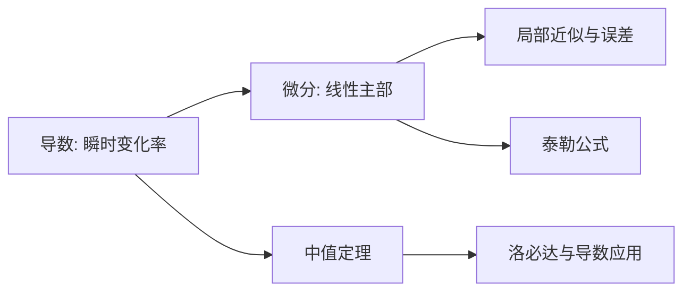

# 微分总结

> [!summary] 核心一句话
> **微分就是函数增量的线性主部。** 当自变量发生很小的变化 $dx$ 时，函数的真实增量为 $\Delta y$，而微分 $dy=f'(x)dx$ 是它最主要、最容易计算的近似部分。

本笔记综合两份基础讲义中“导数与微分”章节：Kira 讲义强调“微分 = 局部线性化”和一阶微分形式不变性；汤家凤讲义强调计算规则、复合结构和题型操作。这里额外补充近似误差和易错边界。

## 1. 从增量到微分

设 $y=f(x)$，在 $x_0$ 处给自变量一个增量

$$
\Delta x=x-x_0.
$$

函数的真实增量是

$$
\Delta y=f(x_0+\Delta x)-f(x_0).
$$

若存在常数 $A$，使

$$
\Delta y=A\Delta x+o(\Delta x),
$$

则称 $f(x)$ 在 $x_0$ 处可微，并把线性主部

$$
dy=A\Delta x
$$

称为函数在该点的微分。通常把 $dx=\Delta x$，于是

$$
\boxed{dy=A\,dx}.
$$

> [!tip] 为什么这是“线性化”
> 曲线在足够小的范围内近似一条切线。$dy$ 是沿切线的竖直变化，$\Delta y$ 是沿原曲线的真实竖直变化；两者的差比 $dx$ 更高阶。

## 2. 可导、可微、连续的关系

对一元函数：

$$
\boxed{\text{可微}\Longleftrightarrow\text{可导}},
$$

且此时

$$
A=f'(x_0),\qquad dy=f'(x_0)dx.
$$

关系链为

$$
\text{可导}\Longrightarrow\text{可微}\Longrightarrow\text{连续}.
$$

反向一般不成立。例如 $f(x)=|x|$ 在 $x=0$ 连续，但左右导数不相等，故不可导也不可微。

## 3. $dy$、$\Delta y$ 与导数：最容易混的三个量

| 量 | 含义 | 公式 |
|---|---|---|
| $\Delta x$ | 自变量真实增量 | $x-x_0$ |
| $\Delta y$ | 因变量真实增量 | $f(x_0+\Delta x)-f(x_0)$ |
| $dy$ | $\Delta y$ 的线性主部 | $f'(x_0)dx$ |
| $f'(x_0)$ | 变化率/切线斜率 | $\displaystyle\lim_{\Delta x\to0}\frac{\Delta y}{\Delta x}$ |

可微时有

$$
\Delta y=dy+o(dx),
$$

因此

$$
\Delta y-dy=o(dx).
$$

若 $f'(x_0)\ne0$，则

$$
\Delta y\sim dy\sim dx.
$$

但 $f'(x_0)=0$ 时不能说 $\Delta y\sim dy$。例如 $y=x^2$ 在 $x=0$ 处，$dy=0$，而 $\Delta y=(\Delta x)^2$。

> [!warning] 不要写 $dy=\Delta y$
> 它们通常只是近似相等。只有函数本身是一次函数时，才对任意增量严格相等。

## 4. 微分公式与运算法则

### 4.1 基本初等函数

| 函数 $y$ | 微分 $dy$ |
|---|---|
| 常数 $C$ | $0$ |
| $x^\alpha$ | $\alpha x^{\alpha-1}dx$ |
| $e^x$ | $e^x dx$ |
| $a^x$ | $a^x\ln a\,dx$ |
| $\ln|x|$ | $\dfrac1x dx$ |
| $\sin x$ | $\cos x\,dx$ |
| $\cos x$ | $-\sin x\,dx$ |
| $\tan x$ | $\sec^2x\,dx$ |
| $\arcsin x$ | $\dfrac1{\sqrt{1-x^2}}dx$ |
| $\arctan x$ | $\dfrac1{1+x^2}dx$ |

### 4.2 四则运算

设 $u,v$ 可微，则

$$
d(u\pm v)=du\pm dv,\qquad d(Cu)=C\,du,
$$

$$
d(uv)=u\,dv+v\,du,
$$

$$
d\left(\frac uv\right)=\frac{v\,du-u\,dv}{v^2}\quad(v\ne0).
$$

这些就是求导法则乘上 $dx$ 后的形式。

## 5. 复合函数：一阶微分形式不变性

若

$$
y=f(u),\qquad u=\varphi(x),
$$

则

$$
\boxed{dy=f'(u)\,du}.
$$

再代入 $du=\varphi'(x)dx$，便有

$$
dy=f'(u)\varphi'(x)dx.
$$

**例：**

$$
y=\sin(x^2+1).
$$

令 $u=x^2+1$，则

$$
dy=\cos u\,du=\cos(x^2+1)\cdot2x\,dx.
$$

> [!tip] 操作口诀
> 先对外层求微分并保留 $du$，再对 $u$ 求微分。这样复合层数再多也不容易漏链式法则。

## 6. 隐函数与参数方程的微分

### 6.1 隐函数

若 $F(x,y)=0$，对两边同时取微分；注意 $y$ 是 $x$ 的函数，所以 $dy$ 不能漏。

**例：**

$$
x^2+y^2=1.
$$

取微分：

$$
2x\,dx+2y\,dy=0,
$$

故

$$
dy=-\frac{x}{y}\,dx,\qquad \frac{dy}{dx}=-\frac{x}{y}\quad(y\ne0).
$$

### 6.2 参数方程

若

$$
x=x(t),\qquad y=y(t),
$$

且 $x'(t)\ne0$，则

$$
\frac{dy}{dx}=\frac{dy/dt}{dx/dt}=\frac{y'(t)}{x'(t)},
$$

从而

$$
dy=\frac{y'(t)}{x'(t)}dx.
$$

## 7. 微分的应用：近似计算与误差

当 $\Delta x$ 很小时，

$$
f(x_0+\Delta x)=f(x_0)+f'(x_0)\Delta x+o(\Delta x),
$$

所以近似公式为

$$
\boxed{f(x_0+\Delta x)\approx f(x_0)+f'(x_0)\Delta x}.
$$

**例：**估算 $\sqrt{4.1}$。

取 $f(x)=\sqrt x$，在 $x_0=4$ 处，$f(4)=2$，

$$
f'(4)=\frac14,\qquad \Delta x=0.1.
$$

故

$$
\sqrt{4.1}\approx2+\frac14\times0.1=2.025.
$$

> [!note] 什么时候近似可靠
> $\Delta x$ 越小，忽略的 $o(\Delta x)$ 越小。若函数弯曲很明显、增量不够小，线性近似误差会增大；此时可用 [[泰勒公式与洛必达法则]] 保留二阶项。

## 8. 考场题型与路线

| 题型 | 第一反应 | 关键点 |
|---|---|---|
| 求 $dy$ | 先求 $y'$，再乘 $dx$ | 不漏 $dx$ |
| 复合函数微分 | 外层 $\to du$，内层继续 | 形式不变性 |
| 隐函数微分 | 两边同时取 $d$ | $y$ 的微分是 $dy$ |
| 参数方程 | 先求 $dy/dx$ | 分母 $x'(t)\ne0$ |
| 近似计算 | 选容易计算的邻近点 $x_0$ | $\Delta x$ 要小 |
| 判断可微 | 回到导数或增量定义 | 一元函数可导即微 |

## 9. 易错点

1. **把 $dy$ 当成 $\Delta y$。**\
   正确：$dy$ 是线性近似，$\Delta y$ 是真实变化。
2. **微分结果忘记写 $dx$。**\
   $y'=2x$，但 $d(x^2)=2x\,dx$。
3. **复合函数只对最外层求一次。**\
   正确：先写 $dy=f'(u)du$，再求 $du$。
4. **隐函数里把 $d(y^2)$ 写成 $2y\,dx$。**\
   正确：$d(y^2)=2y\,dy$。
5. **在导数为零处仍说 $\Delta y\sim dy$。**\
   正确：只有 $f'(x_0)\ne0$ 时才有此结论。
6. **把“连续”反推成“可微”。**\
   $|x|$ 在 $0$ 连续但不可微。

## 10. 知识连接与自检

- [ ] 能用 $\Delta y=A\Delta x+o(\Delta x)$ 说出微分的定义。
- [ ] 能区分 $\Delta y$、$dy$ 和 $y'$。
- [ ] 能写出常用函数及复合函数的微分。
- [ ] 能对隐函数两边同时取微分。
- [ ] 能用线性近似估算一个邻近数值。
- [ ] 知道 $\Delta y\sim dy$ 需要 $f'(x_0)\ne0$。

## 11. 880 题型补充

880 第二章 PDF 第 14–34 页将微分考成“量级、局部符号和隐式变化”，不是只问 $dy=f'(x)dx$。

### 11.1 已知导数，判断 $dy$ 与 $\Delta x$ 的阶

**880 第 15 页第 7 题信号：** 已知 $f'(x_0)=\frac12$，问 $dy$ 与 $\Delta x$ 的关系。

**标准结论：** 在 $x_0$ 处取 $dx=\Delta x$，有

$$
dy=f'(x_0)dx=\frac12\Delta x.
$$

故 $dy$ 与 $\Delta x$ 是同阶无穷小，且 $dy/\Delta x\to1/2$。这里问的是微分的量级，不能把 $\Delta y$ 偷换为 $dy$；只有

$$
\Delta y=dy+o(\Delta x)
$$

才说明线性近似的误差更高阶。

### 11.2 从极限信息反推局部极值：先还原增量

**880 第 15 页第 10 题信号：** 给出 $f(x)/(1-\cos x)\to2$ 一类信息，问原点附近的性态。

**方法：** 因 $1-\cos x\sim x^2/2$，得 $f(x)\sim x^2$。当 $x\ne0$ 且充分接近 $0$ 时 $f(x)>0$。若题设再给 $f(0)=0$，则 $f(0)$ 是严格局部极小值。

**防坑：** 极限只给出 $x\ne0$ 的邻域符号；要判极值，必须再把 $f(0)$ 与附近函数值作比较，不能只说“极限是正的”。

### 11.3 隐式关系取微分：先决定谁是自变量

**题干信号：** “由方程确定 $y=y(x)$”“求 $dy$”“小变化后的近似”。

**标准步骤：** 若 $F(x,y)=0$，则

$$
dF=F_x\,dx+F_y\,dy=0,
$$

从而

$$
dy=-\frac{F_x}{F_y}dx\qquad(F_y\ne0).
$$

先写 $dF=0$ 可以避免在 $d(y^2)$、$d\ln y$ 里漏掉 $dy$。若增量不小，微分只能给近似，不能当精确等式。

### 11.4 微分近似的落点

**题干信号：** 求 $\sqrt[3]{8.03}$、$\ln(1.02)$ 这类邻近数的近似值或误差估计。

选容易计算的 $x_0$，写 $x=x_0+\Delta x$，再写

$$
f(x)\approx f(x_0)+f'(x_0)\Delta x.
$$

答案要同时交代近似中心和忽略的余项；要求更高精度或一阶项碰巧为零时，改用 [[泰勒公式与洛必达法则]]。

### 11.5 880 补充：把微分放回“变化过程”

880 第 20–22、30–31 页中的速度和参数曲线题可统一处理为：先写一个精确关系 $G(q_1,q_2,\ldots)=0$，再对同一个自变量（通常是时间 $t$）取微分或求导。变量变化率是 $dq_i/dt$，不是微分符号 $dq_i$ 本身。

若题设只给

$$
\Delta y=A\Delta x+o(\Delta x),
$$

应立刻读出 $f'(x_0)=A$；若问积分型极限，则先用这条局部信息给出被积函数首项，再积分。这个顺序能避免把“局部线性主部”误当成全区间恒等式。

完整题号见 [[资料/880高数逐题审计#2. 一元函数微分学及应用（PDF 14–34）]]。

### 11.6 880 补强：由 $o(\Delta x)$ 判断可导、由主项判断局部性质

**题干信号：** 880 第 15--18、25、31 页常给增量式、导数定义型极限，或只给函数在一点附近的主项，要求判断可导、极值、凹凸或近似误差。

**统一步骤：** 把题设整理为

$$
f(x_0+\Delta x)-f(x_0)=A\Delta x+r(\Delta x).
$$

若 $r=o(\Delta x)$，则 $f'(x_0)=A$ 且 $df=A\,dx$；若首个非零项是 $B(\Delta x)^m$，再按其奇偶性和符号判断局部性态。求近似时只保留线性项，前提是 $\Delta x$ 足够小且题目没有要求二阶精度。

**条件与易错点：** $r=O(\Delta x)$ 不足以推出可导，因为商 $r/\Delta x$ 未必趋于 $0$；$f'(x_0)=0$ 时 $dy=0$，但 $\Delta y$ 常由二阶或更高阶主项决定，不能断言 $\Delta y\sim dy$；由极限判极值还必须与 $f(x_0)$ 比较。需要高阶符号时转用 [[泰勒公式与洛必达法则#9.6 880 补强：由局部条件反推系数、符号与几何量]]。

## 相关笔记与资料

- [[泰勒公式与洛必达法则]]：更高阶的局部展开和余项。
- [[微分学整理索引]]：微分学的阅读入口。
- 参考讲义：`【一高数Kira】27考研高数基础讲义.pdf` 第二章第三节“微分：局部线性化”；`27汤家凤《高数辅导讲义》基础篇.pdf` 第二章“导数与微分”及例题。
- 题型资料：`【A4紧凑版】李林880数二高数篇做题本.pdf` 第二章，PDF 第 14–34 页。

## 12. 880 具体题型卡：微分的量级、近似与变化率

### 题型 1：由增量极限读出导数和微分

**题干信号：**

$$
\lim_{\Delta x\to0}\frac{f(x_0+\Delta x)-f(x_0)}{\Delta x}=A
$$

或题设直接给 $\Delta y=A\Delta x+o(\Delta x)$（880 PDF 第 14、15、25、31 页）。

**结论链：**

$$
f'(x_0)=A,\qquad dy=A\,dx,\qquad
\Delta y=dy+o(\Delta x).
$$

若 $A\ne0$，则 $dy\sim\Delta y\sim\Delta x$；若 $A=0$，只知 $dy=0$，必须继续找 $\Delta y$ 的高阶主项。**易错点：** 把 $dy=0$ 误读成“函数没有变化”。

### 题型 2：微分近似与误差阶

**题干信号：** 求邻近值，如 $\sqrt[3]{8.03}$ 或带小增量的复合函数（880 PDF 第 18、22 页）。

**步骤：** 选易算中心 $x_0$，令 $\Delta x=x-x_0$，写

$$
f(x)=f(x_0)+f'(x_0)\Delta x+o(\Delta x).
$$

例如 $f(x)=x^{1/3}$、$x_0=8$ 时，$f'(8)=1/12$，故

$$
\sqrt[3]{8.03}\approx2+\frac{0.03}{12}.
$$

**条件与易错点：** 线性近似只适合 $\Delta x$ 足够小；若一阶导数为零或题目要求二阶精度，改用泰勒，不能把一阶近似当精确值。

### 题型 3：相关变化率

**题干信号：** 体积、面积、长度随时间变，已知一个变化率求另一个（880 PDF 第 21、30--31 页）。

**固定步骤：** 先建精确关系，再对 $t$ 求导，最后代入瞬时数值。例如球体

$$
V=\frac43\pi r^3\quad\Longrightarrow\quad
\frac{dV}{dt}=4\pi r^2\frac{dr}{dt}.
$$

**易错点：** 未代当前 $r$ 就解变化率；把 $dr$（微分）与 $dr/dt$（速率）混为同一量。

### 题型 4：绝对值复合与局部可导性

**题干信号：** $|u(x)|$ 在 $u(x_0)=0$ 处，或函数由两侧不同表达式给出（880 PDF 第 14--16、24--25、30 页）。

**步骤：** 不能先套 $d|u|=\operatorname{sgn}(u)du$，因为该公式在 $u=0$ 不适用。应写左右差商：若 $u(x_0)=0$ 且 $u'(x_0)\ne0$，则 $|u(x)|$ 在 $x_0$ 左右导数异号，通常不可导；若 $u'(x_0)=0$，仍要由 $u$ 的局部主项或导数定义继续判断。

**例：** $|x|$ 在 $0$ 的左右导数为 $-1,1$，不可导；$x^2|x|$ 的导数定义商为 $x|x|\to0$，因此在 $0$ 可导。**易错点：** 仅凭内层导数为零就断言可导。

## 13. 两本讲义的条件核对

Kira 的表述重点是“$Δy$ 的线性主部”，汤家凤的表述重点是计算时把 $dx$ 当作自变量增量。复习时保留下面的边界：

1. $dx$ 是人为指定的自变量微分，通常取 $dx=\Delta x$；它不是由题目自动产生的另一个未知量。
2. $dy=f'(x_0)dx$ 是线性近似。只有当 $f$ 为一次函数时，才对任意增量有 $dy=\Delta y$。
3. 隐函数写 $dF=F_xdx+F_ydy=0$ 时，要求在所讨论点 $F_y\ne0$ 才能解出 $dy/dx$；否则应改用分支或参数表示。
4. 近似题先写“中心点 + 增量 + 余项阶数”，再决定一阶微分是否够用；一阶项为零或要求误差阶时转到 [[泰勒公式与洛必达法则]]。

## 14. 最终自检

- [ ] 能从 $\Delta y=A\Delta x+o(\Delta x)$ 读出 $f'(x_0)=A$ 和 $dy=A\,dx$。
- [ ] 能解释 $dy$、$\Delta y$、$dy/dx$ 的不同角色，并指出 $f'(x_0)=0$ 时为什么不能说 $\Delta y\sim dy$。
- [ ] 能独立完成一次复合、隐函数和参数方程微分，并写出分母/可导条件。
- [ ] 能用微分近似一个邻近值，并说明误差来自哪个余项。

## 15. 来源与定位

- Kira《27 考研高数基础讲义》第二章“导数与微分”：PDF 约 58–72 页，尤其是“微分：局部线性化”小节。
- 汤家凤《高数辅导讲义》基础篇第二章“导数与微分”：书内第 29–41 页（PDF 约 38–50 页），用于规则、复合结构和分段点例题。
- [[资料/高数两本讲义阅读索引]]：两本讲义与 880 的页码对照。

## 16. 强化教材增补：微分是“先建精确关系，再做一阶近似”

强化教材把微分题分成两类：**局部线性化**与**相关变化率**。两类都不能跳过原始关系。

### 16.1 由增量式反推函数信息

若题设给出

$$
f(x_0+h)-f(x_0)=Ah+Bh^2+o(h^2),
$$

则不只可读出 $f'(x_0)=A$，还可读出

$$
f''(x_0)=2B.
$$

这里需要余项是 $o(h^2)$；只知道 $o(h)$ 时不能反推二阶导数。反过来，若给切线、曲率或极值条件，应先转成 $f(x_0)$、$f'(x_0)$、$f''(x_0)$ 的信息，再写局部展开。

### 16.2 相关变化率的固定骨架

相关变化率题不从微分公式起步，而是从精确几何/物理关系起步：

$$
G(q_1,q_2,\ldots,q_n)=0
\quad\Longrightarrow\quad
\frac{d}{dt}G(q_1(t),\ldots,q_n(t))=0.
$$

先对同一个时间变量 $t$ 求导，再代入题目给出的“当前状态”。例如 $V=\frac43\pi r^3$ 应先得

$$
\frac{dV}{dt}=4\pi r^2\frac{dr}{dt},
$$

再代入该时刻的 $r$，而不是把 $dr$ 与 $dr/dt$ 混用。

### 16.3 同一问题中的三个层次

| 问法 | 应写什么 | 不能省略的条件 |
|---|---|---|
| 求微分 | $dy=f'(x)dx$ | 可导；复合时保留中间微分 |
| 近似值 | $f(x_0+h)=f(x_0)+f'(x_0)h+o(h)$ | $h$ 小；精度不够时加二阶项 |
| 变化率 | 对精确关系对 $t$ 求导 | 所有变量同属一个过程，并代当前状态 |

强化例题反复利用这一区分：微分是局部线性主部，变化率是对时间的导数，二者有关但不是同一个符号。
