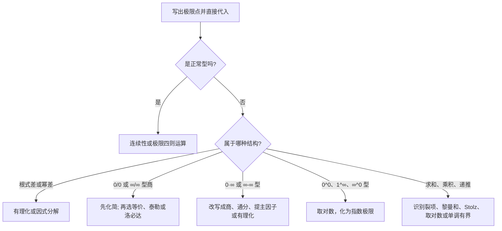

# 求极限专题总结

> [!summary] 总原则
> **先化简，后判型，再选工具。** 极限题考的不是“记住哪条公式”，而是识别表达式中真正控制结果的结构：主项、抵消、累加、乘积、递推或左右逼近。

本笔记综合两份基础讲义中“函数、极限与连续”及“洛必达、泰勒”的方法，并补充数列求和和递推类极限的统一判断框架。

## 1. 先做分类：拿到题目的 20 秒流程

> [!warning] 先判型不是形式主义
> $0/0$、$\infty/\infty$ 是“不能直接代入”的信号，不是答案；而 $1^\infty$、$0\cdot\infty$、$\infty-\infty$ 也不能直接用洛必达，必须先变形。

## 2. 基础层：正常型与无穷远处的主项

### 2.1 正常型

若分母极限非零，或函数在该点连续，直接代入即可。例如

$$
\lim_{x\to1}\frac{x^2+1}{x+2}=\frac23.
$$

### 2.2 有理分式和无穷远极限

分子、分母同除以最高次幂，口诀是“抓大头”。

$$
\lim_{x\to\infty}\frac{3x^2-x+1}{2x^2+5}=\frac32.
$$

当根式中含 $x^2$ 时，要注意绝对值：$\sqrt{x^2}=|x|$。例如 $x\to-\infty$ 时，$\sqrt{x^2}=-x$。

## 3. 恒等变形优先：最短也最稳

| 看到的结构 | 第一反应 | 典型结果 |
|---|---|---|
| $\sqrt{A}-\sqrt{B}$ | 有理化 | 把“差”变成 $\dfrac{A-B}{\sqrt A+\sqrt B}$ |
| $A^m-B^m$ | 因式分解 | 提取 $A-B$ |
| $\infty-\infty$ | 通分、提公因子、有理化 | 消掉表面的无穷大 |
| $f(x)-f(a)$ | 提取 $x-a$ 或用导数定义 | 暴露变化率 |
| $x\to a$ 而非 $0$ | 令 $h=x-a$ | 转为 $h\to0$ |

**例：**

$$
\begin{aligned}
\lim_{x\to\infty}(\sqrt{x^2+x}-x)
&=\lim_{x\to\infty}\frac{x}{\sqrt{x^2+x}+x}\\
&=\frac12.
\end{aligned}
$$

## 4. 无穷小替换：只抓首个主项

当 $u\to0$ 时，常用等价无穷小为

$$
\sin u\sim\tan u\sim\arcsin u\sim\arctan u\sim u,
$$

$$
e^u-1\sim\ln(1+u)\sim u,\qquad
1-\cos u\sim\frac{u^2}{2},
$$

$$
(1+u)^\alpha-1\sim\alpha u,\qquad
\sqrt{1+u}-1\sim\frac u2.
$$

最适合的场景是**乘法、除法**。例如

$$
\lim_{x\to0}\frac{\ln(1+2x)}{\sin3x}
=\frac23.
$$

> [!danger] 加减不能随便替换
> $\sin x\sim x$ 不意味着 $\sin x-x\sim0$。首项已经抵消，必须转入泰勒展开。详见 [[等价无穷小复习讲义]]。

## 5. 泰勒公式：抵消后追踪下一项

出现下列信号时，泰勒通常比等价替换更可靠：

- 分子有 $f(x)-g(x)$，且两者首项会抵消；
- 题目主动减掉了前几项，如 $e^x-1-x$；
- 分母是 $x^m$，需要精确到 $m$ 阶；
- 需要比较高阶无穷小或确定参数。

例如

$$
e^x=1+x+\frac{x^2}{2}+o(x^2),
$$

所以

$$
\lim_{x\to0}\frac{e^x-1-x}{x^2}=\frac12.
$$

**精度原则：**最后若要除以 $x^m$，并且前项会抵消，就把分子展开到 $Ax^m+o(x^m)$。余项会随运算换阶，例如

$$
\frac{o(x^m)}{x^k}=o(x^{m-k}).
$$

## 6. 洛必达法则：只处理两类商

洛必达法则直接适用于

$$
\frac{0}{0},\qquad\frac{\infty}{\infty},
$$

并且要满足：去心邻域内可导、分母导数不为零、导数之比的极限存在（或趋于无穷）。

使用流程：**先判为 $0/0$ 或 $\infty/\infty$ 型 → 求导一次 → 重新判型。**

> [!tip] 工具选择
> 求导后明显更简单，用洛必达；相消阶数、参数比较、需要保留误差，用泰勒；一眼是标准无穷小比值，用等价替换更快。

## 7. 七种未定式：从“长什么样”到“具体怎么做”

七种未定式不是七条公式，而是**直接代入后信息不足**的七种外观。统一处理口令是：

> **代入判型 → 先做恒等变形 → 判断是否发生低阶抵消 → 选择等价无穷小、泰勒、洛必达或夹逼 → 检查定义域与收敛条件。**

每次变形都要保证新表达式与原式在去心邻域内有定义且相等。$0/0$ 与 $\infty/\infty$ 是商型，$0\cdot\infty$ 和 $\infty-\infty$ 要先变成商或普通分式，三种幂指型要先取对数。

### 7.1 $0/0$ 型：先消因子，再比较剩余阶数

**步骤：**代入确认分子、分母都趋于 $0$；有公因子先约去，根式差先有理化；乘除结构可用等价无穷小，有相减抵消则用泰勒；只有求导后更简单时才用洛必达，每次求导后重新判型。

**例：**

$$
\lim_{x\to1}\frac{x^2-1}{x-1}=\lim_{x\to1}(x+1)=2.
$$

若首项抵消，不能只用一阶等价式：

$$
\lim_{x\to0}\frac{e^x-1-x}{x^2}
=\lim_{x\to0}\frac{\frac{x^2}{2}+o(x^2)}{x^2}=\frac12.
$$

### 7.2 $\infty/\infty$ 型：先除主项

代入确认分子、分母都发散。代数式优先同除最高次幂，根式先提出最大幂，再决定是否需要等价、泰勒或洛必达：

$$
\lim_{x\to\infty}\frac{3x^2-x+1}{2x^2+5}
=\lim_{x\to\infty}\frac{3-x^{-1}+x^{-2}}{2+5x^{-2}}=\frac32.
$$

注意 $\sqrt{x^2}=|x|$；例如 $x\to-\infty$ 时 $|x|=-x$，不能直接写成 $x$。

### 7.3 $0\cdot\infty$ 型：把乘积改写成商

若 $f\to0,g\to\infty$，写成 $f/(1/g)$ 或 $g/(1/f)$，选择能形成 $0/0$ 或 $\infty/\infty$ 且更易处理的一种。比如

$$
\lim_{x\to0^+}x\ln x
=\lim_{x\to0^+}\frac{\ln x}{1/x}
=\lim_{x\to0^+}\frac{1/x}{-1/x^2}=0.
$$

若能直接夹逼（如 $|x\sin(1/x)|\le|x|$），夹逼优先；变号时也不能随意取对数。

### 7.4 $\infty-\infty$ 型：把“差”变成“比”或“积”

常用顺序是**通分 → 提主项 → 有理化**，不能把两项分别取极限再相减。

$$
\begin{aligned}
\lim_{x\to\infty}(\sqrt{x^2+x}-x)
&=\lim_{x\to\infty}\frac{x}{\sqrt{x^2+x}+x}\\
&=\lim_{x\to\infty}\frac{1}{\sqrt{1+1/x}+1}=\frac12.
\end{aligned}
$$

### 7.5 $0^0$、$1^\infty$、$\infty^0$：取对数后只研究指数

设 $y=u(x)^{v(x)}>0$，并确认底数在邻域内严格为正。写成 $\ln y=v(x)\ln u(x)=:\Phi(x)$，先求 $\Phi$，再指数还原：若 $\Phi\to L$，则 $y\to e^L$；若 $\Phi\to+\infty$ 或 $-\infty$，则分别趋于 $+\infty$ 或 $0$。

$$
\lim_{x\to0}(1+2x)^{1/x}
=\exp\left(\lim_{x\to0}\frac{\ln(1+2x)}{x}\right)=e^2,
$$

$$
\lim_{x\to0^+}x^x=\exp\left(\lim_{x\to0^+}x\ln x\right)=1,
\qquad
\lim_{x\to\infty}x^{1/x}=\exp\left(\lim_{x\to\infty}\frac{\ln x}{x}\right)=1.
$$

底数趋于 $1$ 不代表答案就是 $e$；必须算出 $v\ln u$。底数非正或跨过 $0$ 时，实数范围内不能直接使用对数法。

### 7.6 处理完后的“停手检查”

- 是否已化为正常型，或新的 $0/0$、$\infty/\infty$？若是，回到对应步骤；
- 等价替换是否只出现在乘法、除法中？有加减抵消就改用泰勒；
- 洛必达的函数是否在去心邻域可导，分母导数是否不为零；
- 取对数前底数是否严格为正，单侧方向和定义域是否保留；
- 得到参数时是否检查目标阶系数不为零，得到数列极限时是否先证明收敛。

## 8. 数列极限：按“和、积、递推”识别

### 8.0 考场常用求和公式

默认求和指标从 $k=1$ 到 $n$。极限题里先判断“能否用精确公式”，再考虑裂项、夹逼或积分估计。

#### 必须熟：等差、等比与前三个幂和

| 类型 | 公式 | 极限中的用途 |
|---|---|---|
| 常数和 | $\displaystyle\sum_{k=1}^n1=n$ | 判断项数 |
| 等差数列 | $\displaystyle\sum_{k=1}^n[a+(k-1)d]=\frac n2[2a+(n-1)d]$ | 线性累加 |
| 自然数和 | $\displaystyle\sum_{k=1}^nk=\frac{n(n+1)}2$ | 主项为 $n^2/2$ |
| 平方和 | $\displaystyle\sum_{k=1}^nk^2=\frac{n(n+1)(2n+1)}6$ | 主项为 $n^3/3$ |
| 立方和 | $\displaystyle\sum_{k=1}^nk^3=\left[\frac{n(n+1)}2\right]^2$ | 主项为 $n^4/4$ |
| 等比数列 | $\displaystyle\sum_{k=0}^na q^k=\frac{a(1-q^{n+1})}{1-q}\ (q\ne1)$ | 裂项外的指数型求和 |

当只要求极限时，比起死背更高次的精确公式，更重要的是记住：

$$
\sum_{k=1}^n k^p\sim\frac{n^{p+1}}{p+1}\qquad(p=0,1,2,\ldots).
$$

例如

$$
\frac{1^2+2^2+\cdots+n^2}{n^3}
\to\frac13,
\qquad
\frac{1^3+2^3+\cdots+n^3}{n^4}
\to\frac14.
$$

> [!tip] 背诵策略
> 优先记住 $\sum k$、$\sum k^2$、$\sum k^3$ 的精确公式。四次及以上幂和通常只需抓主项，或在特定题中用黎曼和、夹逼来处理。

#### 常见分式和与调和和

$$
\frac1{k(k+1)}=\frac1k-\frac1{k+1},
$$

$$
\frac1{4k^2-1}
=\frac12\left(\frac1{2k-1}-\frac1{2k+1}\right).
$$

这两类是最常见的裂项模板。对于调和和

$$
H_n=\sum_{k=1}^n\frac1k,
$$

无需背精确值，但要知道

$$
\ln(n+1)\le H_n\le1+\ln n,
$$

因此 $H_n\sim\ln n$。更一般地，$\sum_{k=1}^n1/k^p$ 在 $p>1$ 时收敛，$p=1$ 时与 $\ln n$ 同阶。

#### 二项式求和（遇到组合数时再用）

$$
\sum_{k=0}^n\binom nk=2^n,
\qquad
\sum_{k=0}^nk\binom nk=n2^{n-1}.
$$

它们通常出现在含 $\binom nk$ 的数列或概率型极限中，不是普通幂和题的首选工具。

### 8.1 裂项相消

先尝试因式分解和部分分式：

$$
\frac1{4k^2-1}
=\frac12\left(\frac1{2k-1}-\frac1{2k+1}\right).
$$

因此

$$
\sum_{k=1}^n\frac1{4k^2-1}
=\frac12\left(1-\frac1{2n+1}\right)
\to\frac12.
$$

### 8.2 黎曼和：很多个小长方形

若能化成

$$
\frac1n\sum_{k=1}^n f\left(\frac{k}{n}\right),
$$

就有

$$
\frac1n\sum_{k=1}^n f\left(\frac{k}{n}\right)
\to\int_0^1f(t)\,dt.
$$

例如

$$
\sum_{k=1}^n\frac{k}{n^2+n+k}
=\frac1n\sum_{k=1}^n
\frac{k/n}{1+1/n+k/n^2}
\to\int_0^1t\,dt=\frac12.
$$

### 8.3 Stolz 定理：拓展工具，不作考场首选

> [!warning] 数二考场策略
> Stolz 定理不属于数二复习中应默认直接引用的核心定理。练习时可用它理解“累加量之比”，但考场优先使用大纲内更稳的求和公式、夹逼准则、单调有界准则、等价无穷小或积分定义。只有题目所在课程明确允许，且你能完整写清条件时，再把它作为快捷方法。

例如

$$
\lim_{n\to\infty}\frac{1^2+2^2+\cdots+n^2}{n^3}
=\lim_{n\to\infty}\frac{n(n+1)(2n+1)}{6n^3}
=\frac13,
$$

这才是本题在数二考场最短、最规范的写法。

Stolz 定理本身的内容是：

若 $y_n$ 严格递增且 $y_n\to\infty$，并且

$$
\lim_{n\to\infty}\frac{x_{n+1}-x_n}{y_{n+1}-y_n}=L,
$$

则

$$
\lim_{n\to\infty}\frac{x_n}{y_n}=L.
$$

它适合“分子、分母都是累加量”。例如

$$
\lim_{n\to\infty}\frac{1^2+2^2+\cdots+n^2}{n^3}
=\lim_{n\to\infty}\frac{(n+1)^2}{(n+1)^3-n^3}
=\frac13.
$$

### 8.4 乘积与 $n$ 次根

遇到

$$
\sqrt[n]{\prod_{k=1}^n a_{n,k}},
$$

先取对数，把乘积化为和，再考虑平均值或黎曼和。例如

$$
\frac{\sqrt[n]{(n+1)(n+2)\cdots(2n)}}{n}
\to\exp\left(\int_0^1\ln(1+t)\,dt\right)
=\frac4e.
$$

### 8.5 递推数列

核心是三步：

1. 证明单调；
2. 证明有界；
3. 设极限为 $L$，对递推式取极限，解 $L=f(L)$。

例如 $a_{n+1}=\sqrt{2+a_n}$，若初值合适，先证单调有界，最后由 $L=\sqrt{2+L}$ 得 $L=2$。

## 9. 夹逼、比较与存在性判断

当不能直接计算时，先问“是否至少能证明它存在”。常用工具：

- **夹逼准则**：$a_n\le x_n\le b_n$，且两端同趋于 $A$，则 $x_n\to A$；
- **单调有界准则**：单调增有上界，或单调减有下界，则收敛；
- **子列判别发散**：若有两个子列极限不同，原数列发散；
- **左右极限**：函数极限存在，当且仅当左右极限都存在且相等。

## 10. 易错清单

1. 只要是分式就用洛必达。\
   先判型；非 $0/0$、$\infty/\infty$ 不能直接用。
2. 在加减中逐项等价替换。\
   先检查抵消；有抵消就展开。
3. 把 $1^\infty$ 直接当成 $e$。\
   它是未定式，必须看 $v_n\ln u_n$。
4. 忘记定义域或单侧。\
   如 $\ln x$ 在 $x\to0$ 时只能讨论 $0^+$。
5. 把含 $n$ 项的和当成有限项逐项取极限。\
   优先考虑裂项、比较、Stolz 或黎曼和。
6. 在 $x\to-\infty$ 时把 $\sqrt{x^2}$ 写成 $x$。\
   永远先写成 $|x|$。

## 11. 考场工具选择表

| 题目特征 | 优先工具 | 备用工具 |
|---|---|---|
| 标准小量的乘除 | 等价无穷小 | 夹逼、洛必达 |
| 高阶抵消 | 泰勒公式 | 多次洛必达 |
| 根式差 | 有理化 | 提主因子 |
| 无穷远代数式 | 最高次项 | 分子分母同除最高次幂 |
| 幂指型 | 取对数 | 等价无穷小、洛必达 |
| 裂项求和 | 部分分式 | 比较判别 |
| 含 $k/n$ 的 $n$ 项和 | 黎曼和 | 夹逼 |
| 累加量之比 | Stolz 定理 | 求和公式、积分比较 |
| 递推数列 | 单调有界 | 压缩映射、夹逼 |

## 12. 复习闭环

- [ ] 能先区分正常型与七种未定式。
- [ ] 能说清等价替换为何不适合加减抵消。
- [ ] 能根据分母阶数决定泰勒展开的阶数。
- [ ] 能把 $1^\infty$ 型改写为 $e^{v\ln u}$。
- [ ] 能识别裂项和、黎曼和、Stolz 定理的使用信号。
- [ ] 能完成“递推数列：单调 + 有界 + 不动点”三步。

## 13. 880 题型补充

880 第一章（PDF 第 2–13 页）真正训练的是：先看出**相消发生在哪一层**，再决定提主项、有理化、展开还是改写。以下模板来自第 2、4 页的同阶比较和根式、对数、三角混合极限。

### 13.1 “与 $x^m$ 同阶”或“求参数”

**题干信号：** 出现“与 $x^m$ 是同阶无穷小”“使极限非零有限”，且分子中有可调参数。例如 880 第 2 页第 8 题的

$$
e^x-\frac{1+ax^2}{1+bx}
$$

要求与 $x^3$ 同阶。

**标准步骤：**

1. 先写出分母所需阶数；本题要保留到 $x^3$。
2. 展开每个发生相消的整体，而不是只展开其中一个因子：

$$
e^x=1+x+\frac{x^2}{2}+\frac{x^3}{6}+o(x^3),
$$

$$
\frac{1+ax^2}{1+bx}=(1+ax^2)(1-bx+b^2x^2-b^3x^3)+o(x^3).
$$

3. 令常数项、一次项、二次项依次消失；最后检查三次项系数**不为零**。前两步只保证阶数不低于三阶，最后一步才保证“同阶”。

**易错边界：** 只列出 $a,b$ 使低阶项消失，却不验三阶系数，会把“高阶小量”误判为“同阶小量”。

### 13.2 两个小量谁更高阶

**题干信号：** 880 第 2 页第 7 题这一类比较 $(x-\sin x)\tan x$、$\ln(1+x^n)$ 与 $x^2$ 的阶。

**应想到的结构：** 先把每个因子化成幂次。

$$
x-\sin x\sim\frac{x^3}{6},\qquad \tan x\sim x,
$$

所以 $(x-\sin x)\tan x\sim x^4/6$；而 $\ln(1+x^n)\sim x^n$。比较阶数就是比较 $4$、$n$ 与 $2$。

**固定口令：** 乘积先逐因子定阶，和差先警惕抵消；不要看到三角函数就直接洛必达。

### 13.3 根式差和“长得很复杂”的 $0/0$

**题干信号：** 880 第 4 页有根式差、对数/指数抵消及 $\cot x(1/\sin x-1/x)$ 型。

**标准路线：**

- 根式差：乘共轭，把危险的差变成可比较的乘积；若分母也有根式，先提主项或再有理化。
- $\cot x(1/\sin x-1/x)$：先合并括号中的分式，得到

  $$
  \cot x\cdot\frac{x-\sin x}{x\sin x},
  $$

  再分别使用 $\cot x\sim1/x$、$x-\sin x\sim x^3/6$、$\sin x\sim x$。这比连续两次洛必达更稳，且能看清极限常数从哪里来。
- 指数、对数相减：先问“常数项是否抵消、需要到几阶”；有抵消就转 [[泰勒公式与洛必达法则]]。

### 13.4 数列极限不强行当函数极限

**题干信号：** 有 $n$ 次根、和式或 $a_n^{b_n}$（880 第 4 页）。

**方法选择：** 根式先提最大幂；和式先判断能否裂项、夹逼或化为黎曼和；幂指式写 $\ln a_n^{b_n}=b_n\ln a_n$。只有表达式本身自然延拓为函数且求导更简单时，才考虑把 $n$ 换为实变量。

> [!warning] 最后一问
> 每道极限题都要写清：我利用的等价关系的自变量是否趋于 $0$？是否存在加减抵消？这是 880 第一章最常见的误判来源。

### 13.5 880 补充：连续、数列与函数方程

880 第 3、5、7、10–13 页还有三类不能被“算极限”覆盖的题。

- **分段点连续/间断：** 题干给分段式或问间断点，固定写左极限、右极限、函数值三项；连续要求三者相等。只问“第一类间断点”时，还要区分左右极限存在但不等（跳跃）与极限存在但函数值不等（可去）。
- **递推数列：** 题干给 $x_{n+1}=\varphi(x_n)$ 或两项递推，先找不变区间，再证单调有界，最后令极限 $L=\varphi(L)$。若递推是线性的，先解特征方程；若是乘积，先取对数或寻找裂项，不能直接把 $n\to\infty$ 代入递推式。
- **函数方程：** 含 $f(x)+f(1/x)$、$f(xy)$ 之类关系时，先用 $x\mapsto1/x$ 或特殊值写出第二个方程，再联立；要求奇偶性时，比较 $f(-x)$ 与 $f(x)$，不能从一个局部极限直接推全局性质。

这三类在 [[资料/880高数逐题审计]] 的第 1 章逐页登记；它们分别回扣“连续定义”“单调有界”和“函数恒等变形”，不应被误塞进等价无穷小模板。

### 13.6 880 补强：积分型、反函数根与取整极限

**题干信号：** 880 第 8--12 页把极限藏进 $\int_0^{\alpha(x)}q(t)\,dt$、方程 $F(y)=x$ 所确定的反函数根，或 $[u(x)]$（整数部分）中。它们的共同点是：不能只对外层符号做等价替换，必须先还原里面的局部量。

**统一步骤：**

1. 积分上限趋于 $0$ 时，先写 $q(t)=ct^r+o(t^r)$，再积分：

   $$
   \int_0^{\alpha(x)}q(t)\,dt
   =\frac{c}{r+1}\alpha(x)^{r+1}+o\!\left(\alpha(x)^{r+1}\right),
   $$

   其中必须有 $r>-1$，并确认上限趋向方向使积分有定义。幂次会加 $1$，这是与普通复合等价式最不同的地方。
2. 若 $F(y)=x$、$F(0)=0$ 且 $F'(0)\ne0$，先由 $F(y)=F'(0)y+o(y)$ 得

   $$
   y\sim\frac{x}{F'(0)}.
   $$

   只有导数非零时才可直接这样反解；首导数为零时要追踪 $F$ 的首个非零高阶项，且须结合单调性或题设保证局部反函数存在。
3. 含 $[u(x)]$ 时，先用 $[u]\le u<[u]+1$ 或把 $u(x)$ 所在的整数区间锁定；若 $u(x)$ 靠近整数，左右极限要分开，不能把整数部分当连续函数。

**易错点：** 把积分型极限误写成 $q(\alpha(x))$ 的同阶；反函数根没有核对分支和 $F'(0)$；取整题只代入极限而漏掉整数跳跃。对应的积分主项细节见 [[定积分及其应用#12.1.2 $x^k\int_0^xf(t)\,dt$ 的极值：积分本身会多给一个 $x$]]。

## 相关笔记与资料

- [[等价无穷小复习讲义]]：标准小量、余项和展开精度。
- [[泰勒公式与洛必达法则]]：泰勒与洛必达的条件、题型和误区。
- [[微分学整理索引]]：微分学部分的学习顺序。
- 参考讲义：`【一高数Kira】27考研高数基础讲义.pdf` 第一章“函数、极限与连续”；`27汤家凤《高数辅导讲义》基础篇.pdf` 对应极限章节与例题。
- 题型资料：`【A4紧凑版】李林880数二高数篇做题本.pdf` 第一章，PDF 第 2–13 页。

## 14. 880 具体题型卡：函数、极限、连续

### 题型 1：参数相消后“恰为 $x^m$ 阶”

**题干信号：** 求 $a,b$，使 $A(x;a,b)\sim cx^m$，或使 $\lim A(x)/x^m$ 为非零有限数（880 PDF 第 2、9、11 页）。

**做题模板：** 以

$$
A(x)=e^x-\frac{1+ax^2}{1+bx}
$$

为例，目标是三阶。写在同一精度下：

$$
e^x=1+x+\frac{x^2}{2}+\frac{x^3}{6}+o(x^3),
$$

$$
\frac{1+ax^2}{1+bx}
=1-bx+(a+b^2)x^2-(ab+b^3)x^3+o(x^3).
$$

1. 令常数、一次、二次项系数均为 $0$；
2. 解参数；
3. 将参数代回，验 $x^3$ 系数 $\ne0$；
4. 该系数就是 $\lim A(x)/x^3$。

**易错点：** “低阶项全消”只得到 $A=o(x^{m-1})$，不等于与 $x^m$ 同阶；最后一阶系数也必须检查。

### 题型 2：根式、三角组合的乘积型极限

**题干信号：** 有 $x-\sin x$、$1-\cos x$、根式差，且整体是乘积/商（880 PDF 第 2、4 页）。

**标准化简：**

$$
\lim_{x\to0}\frac{(x-\sin x)\tan x}{x^4}
=\lim\frac{x-\sin x}{x^3}\cdot\frac{\tan x}{x}
=\frac16.
$$

若是 $\sqrt{u(x)}-\sqrt{v(x)}$，先乘共轭：

$$
\sqrt u-\sqrt v=\frac{u-v}{\sqrt u+\sqrt v},
$$

再分别给 $u-v$ 和分母定阶。**顺序：** 先通分/有理化，把“差”改成“积”，最后才用等价式。

### 题型 3：分段连续与间断点分类

**题干信号：** 分界点含参数，问连续、可去/跳跃/无穷间断（880 PDF 第 3、5、7 页）。

**三行步骤：**

$$
L_- =\lim_{x\to x_0^-}f(x),\qquad
L_+=\lim_{x\to x_0^+}f(x),\qquad f(x_0).
$$

1. $L_-=L_+=f(x_0)$：连续；
2. $L_-=L_+\ne f(x_0)$ 或 $f(x_0)$ 未定义：可去间断；
3. $L_-,L_+$ 都有限但不等：跳跃间断；其余再判无穷或振荡间断。

**易错点：** 只令左右极限相等而未令其等于函数值，漏掉可去间断。

### 题型 4：递推数列与幂指数列

**题干信号：** $a_{n+1}=\varphi(a_n)$、$a_n^{b_n}$ 或根式递推（880 PDF 第 10--13 页）。

**递推固定步骤：** 先找不变区间 $[\alpha,\beta]$，证明 $a_n$ 不出区间；再用

$$
a_{n+1}-a_n=\varphi(a_n)-a_n
$$

判单调；单调有界后设 $a_n\to L$，最后解 $L=\varphi(L)$ 并用区间筛根。幂指题一律先写

$$
\ln(a_n^{b_n})=b_n\ln a_n,
$$

求出右端极限后再指数还原。不能直接把极限代入递推式来“证明”收敛。

### 题型 5：等分割和式还原为黎曼和

**题干信号：** 求和号有 $k/n$、$\Delta x=1/n$ 或 $\Delta x=(b-a)/n$，整体还有 $1/n$ 因子（880 PDF 第 8--9 页）。

$$
\lim_{n\to\infty}\frac1n\sum_{k=1}^n\phi\!\left(\frac kn\right)
=\int_0^1\phi(t)\,dt.
$$

**四步：** 把 $1/n$ 标为小区间宽度 $\to$ 将 $k/n$ 标为取样点 $t_k$ $\to$ 确定区间 $[0,1]$（一般题先提取 $(b-a)/n$）$\to$ 写定积分并计算。若和式是 $\sum k^p/n^{p+1}$，先改成 $\frac1n\sum(k/n)^p$。

**易错点：** 漏掉外面的 $1/n$；把 $k/n$ 的上下端点误判为 $[1,n]$；被积函数不连续或端点奇异时不能不加判断地当普通黎曼和。

### 补充题型：函数性质、反函数根与函数方程

**题干信号：** 问定义域、奇偶性、周期性、反函数根的极限，或给 $f(x)+f(1/x)$、$f(xy)$ 型等式（880 PDF 第 2--5、10--13 页）。

**做题顺序：**

1. 定义域先逐个列出根式、分母、对数、反三角的限制，再取交集；
2. 奇偶性比较 $f(-x)$ 与 $f(x)$，前提是定义域关于原点对称；周期性需同时验证定义域和最小正周期，不能只看一个三角因子；
3. 若 $F(y)=x,F(0)=0,F'(0)\ne0$，则由 $F(y)=F'(0)y+o(y)$ 得

   $$
   y\sim\frac{x}{F'(0)};
   $$

4. 函数方程先代特殊值，再作对称代换，如 $x\mapsto1/x$，得到第二个方程后联立；只有恒等关系才能在两边同时求导。

**易错点：** 反函数首导数为零时仍强用线性反解；由局部极限或单个点值直接断言全局奇偶、周期性质。

### 题型 6：导数定义和积分平均的极限

**题干信号：**

$$
\frac{f(x)-f(x_0)}{x-x_0},\qquad
\frac1{x-x_0}\int_{x_0}^{x}f(t)\,dt
$$

（880 PDF 第 8--9、11--12 页）。

**公式：** 若 $f$ 在 $x_0$ 连续，

$$
\lim_{x\to x_0}\frac1{x-x_0}\int_{x_0}^{x}f(t)\,dt=f(x_0).
$$

若 $f(x_0)=0$ 且 $f$ 可导，则积分主项为 $f'(x_0)(x-x_0)^2/2$。**步骤：** 先判是平均值型还是导数定义型；平均值型用积分中值/连续性，需更高阶时再展开 $f(t)$ 后积分。**易错点：** 误把平均值型直接等同 $f'(x_0)$。

## 15. 教材主线与最终自检

两本讲义对极限题的共同顺序是“先化简，再判型，最后选工具”。Kira 更适合建立标准极限、连续性和工具边界；汤家凤更适合补换元、有理化、数列和综合计算。复习时把下列顺序写在草稿首行：

1. 直接代入并标记极限点、定义域和左右方向。
2. 先做恒等变形：因式分解、通分、有理化、换元。
3. 判断是否为乘除、加减抵消、递推、幂指或黎曼和结构。
4. 只在条件满足时选择等价无穷小、泰勒或洛必达；做完检查余项/收敛性。

- [ ] 能区分正常型与未定式，并写出至少一种合法的化简动作。
- [ ] 能说明等价无穷小为什么不能直接用于相减抵消。
- [ ] 能把 $0^0$、$1^\infty$、$\infty^0$ 先取对数转成指数极限。
- [ ] 能把等分割和式还原为黎曼和，并检查被积函数在区间上的连续性或可积性。
- [ ] 遇到 $x\to a\ne0$、单侧极限或分段函数时，能先换元/分侧再计算。

## 16. 来源与定位

- Kira《27 考研高数基础讲义》第一章“函数、极限与连续”及第三章“洛必达法则”：PDF 约 1–57、82–97 页。
- 汤家凤《高数辅导讲义》基础篇第一章及第三章相关页段：PDF 约 1–37、65–81 页；扫描版以书内页码为准。
- [[资料/高数两本讲义阅读索引]]：后续按已定位页段读取，不重复扫描整本讲义。

## 17. 强化教材增补：把极限识别成“可求导对象”

强化讲义补出的高频分流是：表达式看似是极限，实质可能是导数定义、反函数局部反演、变限积分或数列差商。

### 17.1 反函数在零点附近的首项

若 $F(0)=0$、$F'(0)\ne0$，且 $y=F^{-1}(x)$，则

$$
F(y)=F'(0)y+o(y)=x
\quad\Longrightarrow\quad
y\sim\frac{x}{F'(0)}.
$$

这不是“把反函数求导公式背一遍”就结束：先确认反函数在邻域存在，再确认首导数非零；若 $F'(0)=0$，需要找更高阶主项，线性反演失效。

### 17.2 变限积分极限先变成导数

出现

$$
\frac{\int_a^{\varphi(x)}f(t)\,dt}{x-x_0}
$$

时，若分子在 $x_0$ 为 $0$，先设 $G(x)=\int_a^{\varphi(x)}f(t)\,dt$。在条件满足时

$$
G'(x)=f(\varphi(x))\varphi'(x),
$$

原极限就是 $G'(x_0)$；若 $G(x_0)\ne0$，则先处理常数项，不能强行套导数定义。

### 17.3 数列极限的差商结构

当 $\frac{a_n}{b_n}$ 是 $\infty/\infty$ 或 $0/0$ 型，且 $b_n$ 严格单调趋于无穷（或趋于 $0$），可考虑 Stolz 定理：

$$
\lim_{n\to\infty}\frac{a_n}{b_n}
=\lim_{n\to\infty}\frac{a_{n+1}-a_n}{b_{n+1}-b_n},
$$

前提是右端极限存在且定理的单调条件满足。它是数列的“差商化”，不是任意数列都能直接相除做差。

### 17.4 强化后的工具选择

| 表达式特征 | 第一选择 |
|---|---|
| $f(x)-f(x_0)$ 除以 $x-x_0$ | 导数定义 |
| 积分上限随 $x$ 变 | 变限积分函数求导 |
| 反函数或隐式定义 | 局部反演/隐函数首项 |
| 数列的比值 | 单调条件下 Stolz，或先化为黎曼和/对数 |
| 参数抵消或高阶相消 | 泰勒，不用一阶等价式硬换 |

---

## 18. 补全：闭区间连续函数的四大性质（数二必考）

“连续”不只是分段点判左极限、右极限、函数值；在闭区间上的连续函数还有四个整体性质，是方程根存在性、中值定理和证明题的地基。

设 $f$ 在 $[a,b]$ 上连续。

1. **有界性定理**：$f$ 在 $[a,b]$ 上有界，即存在 $M>0$，使 $|f(x)|\le M$。
2. **最值定理**：$f$ 在 $[a,b]$ 上必取得最大值与最小值。开区间连续不保证有最值（如 $f(x)=x$ 在 $(0,1)$ 上无最值）。
3. **介值定理**：若 $f(a)\ne f(b)$，则对介于 $f(a)$ 与 $f(b)$ 之间的任一值 $\mu$，存在 $\xi\in(a,b)$，使 $f(\xi)=\mu$。
4. **零点定理（根的存在性）**：若 $f(a)f(b)<0$，则存在 $\xi\in(a,b)$，使 $f(\xi)=0$。它是介值定理取 $\mu=0$ 的特例。

> [!tip] 四条性质在数二中的位置
> - 零点定理/介值定理是“证明方程 $f(x)=k$ 至少有一根”的默认工具，常配单调性证唯一根。
> - 最值定理是费马引理（可导极值点导数必为零）的前提，进而推出罗尔定理。
> - 有界性/最值定理常与“闭区间 + 连续”条件一起出现，开区间或无界区间不能直接套。

### 18.1 判定口诀

| 条件 | 可用结论 | 易错点 |
|---|---|---|
| 闭区间 + 连续 | 有界、有最值、介值、零点 | 开区间、半开区间不保证 |
| $f(a)f(b)<0$ + 连续 | $(a,b)$ 内至少一个零点 | 不保证唯一；零点个数需单调性 |
| 闭区间连续 + 单调 | 零点唯一 | 先存在（零点定理）再唯一（单调） |

### 18.2 代表题

证明方程 $x^5+2x-1=0$ 在 $(0,1)$ 内恰有一根。

令 $f(x)=x^5+2x-1$，在 $[0,1]$ 上连续。$f(0)=-1<0$，$f(1)=2>0$，由零点定理，存在 $\xi\in(0,1)$ 使 $f(\xi)=0$。又 $f'(x)=5x^4+2>0$，故 $f$ 严格递增，零点唯一。

> [!warning] 别把零点定理和导数混用
> 判断“至少一个根”用连续性（零点/介值定理）；判断“至多一个根”用单调性（导数符号）。两者结合才能写“恰有一个根”。

相关笔记：[[中值定理题型与辅助函数总结]]（费马/罗尔依赖最值与零点定理）。
