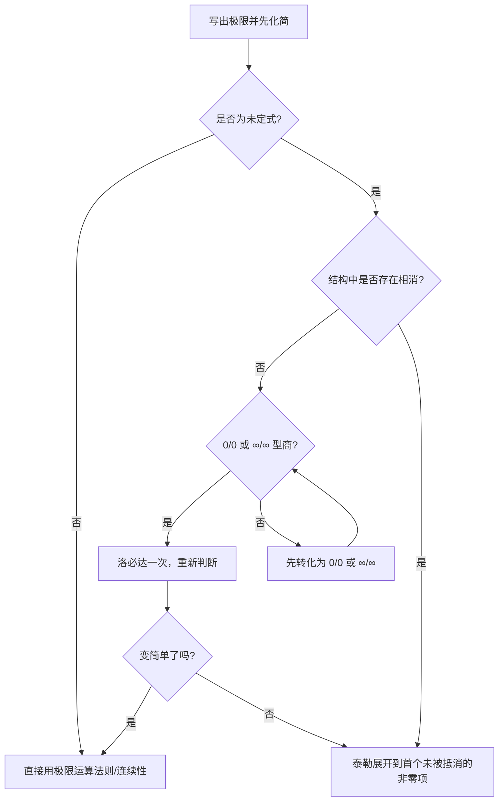

# 泰勒公式与洛必达法则

> [!summary] 先记住这一页
> - **泰勒公式**：把函数在某点附近写成“多项式主部 + 余项”，适合处理相消、精确到高阶、证明不等式和求高阶导数。
> - **洛必达法则**：把 $0/0$ 或 $\infty/\infty$ 型商的极限，转化为导数之比的极限；它是有条件的，不能见到极限就用。
> - **做题总原则**：先化简、再判型、后选工具；先看最低非零阶，谁能最快暴露主导项就用谁。
> - **一句话区分**：洛必达是在“反复求导”，泰勒是在“保留局部展开的层数”。相消越多，泰勒通常越稳。

## 0. 这两个工具在极限题中的位置

考研极限题建议按下面的优先级思考：

1. **恒等变形**：因式分解、通分、约分、有理化、换元。
2. **识别标准小量**：$\sin u\sim u$、$e^u-1\sim u$、$\ln(1+u)\sim u$ 等。
3. **判断是否有抵消**：有加减抵消时，直接等价替换可能丢掉真正的主项。
4. **选择泰勒或洛必达**：
   - 只想求一个简单的商极限，洛必达往往快；
   - 需要知道“差到第几阶”、带参数分类或证明不等式，泰勒往往更透明。

### 0.1 考点地图

| 层级 | 考点 | 你要达到的程度 |
|---|---|---|
| ★★★ 必考 | 常用麦克劳林展开、展开阶数、$0/0$ 与 $\infty/\infty$ 型洛必达 | 能独立完成常规极限，步骤规范 |
| ★★★ 必考 | 相消型极限、非零点展开、七种未定式转换 | 能先判断结构，再选工具 |
| ★★ 高频 | 泰勒求高阶导数、拉格朗日余项证明不等式 | 能从系数读导数，能说明余项符号 |
| ★★ 高频 | 泰勒与等价无穷小、洛必达的综合使用 | 知道什么时候替换会失效，能及时换方法 |
| ★ 易错 | 洛必达条件、反向结论、定义域、单侧极限 | 不因“上下求导”丢条件分 |

---

## 1. 泰勒公式：用多项式抓住函数的局部结构

### 1.1 带皮亚诺余项的泰勒公式（局部形式）

若函数在 $x_0$ 附近具有直到 $n$ 阶导数，则在 $x\to x_0$ 时

$$
f(x)=\sum_{k=0}^{n}\frac{f^{(k)}(x_0)}{k!}(x-x_0)^k+o\big((x-x_0)^n\big).
$$

写开就是

$$
f(x)=f(x_0)+f'(x_0)(x-x_0)+\frac{f''(x_0)}{2!}(x-x_0)^2+\cdots+\frac{f^{(n)}(x_0)}{n!}(x-x_0)^n+o((x-x_0)^n).
$$

这里的 $o((x-x_0)^n)$ 表示：除以 $(x-x_0)^n$ 后趋于 $0$。它不是一个具体数字，而是“比 $n$ 阶还高阶的小量”。

### 1.2 带拉格朗日余项的泰勒公式（证明、估计、判断符号）

若函数在包含 $x_0$ 和 $x$ 的区间上具有足够阶的连续导数，则存在介于 $x_0$ 与 $x$ 之间的 $\xi$，使

$$
f(x)=\sum_{k=0}^{n}\frac{f^{(k)}(x_0)}{k!}(x-x_0)^k+R_n(x),
$$

其中

$$
R_n(x)=\frac{f^{(n+1)}(\xi)}{(n+1)!}(x-x_0)^{n+1}.
$$

**选择余项的经验：**

- 求极限：常用皮亚诺余项，写到需要的阶数即可；
- 证明不等式、误差估计：要看余项符号或大小，使用拉格朗日余项；
- 题目问“在区间上”的公式：不能只写局部的 $o$，要写清楚 $\xi$ 所在区间。

### 1.3 麦克劳林展开（$x_0=0$）

$$
f(x)=f(0)+f'(0)x+\frac{f''(0)}{2!}x^2+\cdots+\frac{f^{(n)}(0)}{n!}x^n+o(x^n).
$$

考研里看到 $x\to0$ 时，默认优先考虑麦克劳林展开；看到 $x\to a$ 时，先令 $h=x-a$，再在 $h\to0$ 下展开。

### 1.4 高频展开表

默认 $u\to0$。实际做题中，把下表的 $x$ 换成任何趋于 $0$ 的整体 $u=u(x)$ 即可。

| 函数             | 展开式（写到常用阶）                                                                                    | 记忆重点                   |
| -------------- | --------------------------------------------------------------------------------------------- | ---------------------- |
| $e^u$          | $1+u+\dfrac{u^2}{2!}+\dfrac{u^3}{3!}+\dfrac{u^4}{4!}+o(u^4)$                                  | 各阶系数都是 $1/k!$          |
| $\sin u$       | $u-\dfrac{u^3}{3!}+\dfrac{u^5}{5!}+o(u^5)$                                                    | 只有奇次幂，符号交替             |
| $\cos u$       | $1-\dfrac{u^2}{2!}+\dfrac{u^4}{4!}+o(u^4)$                                                    | 只有偶次幂                  |
| $\ln(1+u)$     | $u-\dfrac{u^2}{2}+\dfrac{u^3}{3}-\dfrac{u^4}{4}+o(u^4)$                                       | 符号交替，分母是阶数             |
| $(1+u)^\alpha$ | $1+\alpha u+\dfrac{\alpha(\alpha-1)}{2!}u^2+\dfrac{\alpha(\alpha-1)(\alpha-2)}{3!}u^3+o(u^3)$ | 二项式展开                  |
| $\dfrac1{1-u}$ | $1+u+u^2+u^3+o(u^3)$ | 等比级数，$|u|<1$ |
| $\dfrac1{1+u}$ | $1-u+u^2-u^3+o(u^3)$ | 上式的 $u\to-u$ |
| $\tan u$       | $u+\dfrac{u^3}{3}+\dfrac{2u^5}{15}+o(u^5)$                                                    | 三阶常用                   |
| $\arcsin u$    | $u+\dfrac{u^3}{6}+\dfrac{3u^5}{40}+o(u^5)$                                                    | 三阶常用                   |
| $\arctan u$    | $u-\dfrac{u^3}{3}+\dfrac{u^5}{5}+o(u^5)$                                                      | 和 $\ln(1+u)$ 一样交替但系数不同 |

由上表立即得到常用等价无穷小：

$$
\sin u\sim u,\quad \tan u\sim u,\quad e^u-1\sim u,\quad \ln(1+u)\sim u,
$$

$$
1-\cos u\sim\frac{u^2}{2},\quad (1+u)^\alpha-1\sim\alpha u.
$$

> [!warning] 等价替换的边界
> $f\sim g$ 适合在乘法、除法中替换；在 $f-g$ 中不能无脑替换。比如 $\sin x\sim x$，但 $\sin x-x$ 不是“约等于 $0$”就结束，而要继续看三阶项：$\sin x-x\sim -x^3/6$。

### 1.5 展开点怎么选

展开点 $x_0$ 通常来自以下信号：

- 极限变量趋近的点：$x\to a$ 就围绕 $a$ 展开；
- 题目给出的函数值容易算的点：如 $\ln x$ 在 $x=1$ 处；
- 分子、分母都出现 $x-a$：直接令 $h=x-a$；
- 要求某点的高阶导数：优先在该点展开。

**最稳的换元：**

$$
x\to a\quad\Longrightarrow\quad h=x-a\to0,
$$

然后把所有东西改写成 $h$ 的幂。不要一边用 $x-a$，一边又把它当成 $x$，否则阶数容易错位。

### 1.6 展开到几阶：建立“阶数账本”

这是泰勒题最值得训练的能力。

1. 先判断分母的最低阶。例如分母是 $x^4$，分子至少要看到四阶。
2. 展开分子时，若前几阶会相消，就继续往后写。
3. 分子、分母都只保留“最终会影响答案”的最低非零阶。
4. 最后再做比值，不能在相消前提前截断。

例如：

$$
\sin x-x+\frac{x^3}{6}=\frac{x^5}{120}+o(x^5),
$$

因为一阶和三阶都被题目主动抵消，真正主项是五阶。

### 1.7 泰勒公式与高阶导数

如果

$$
f(x)=a_0+a_1x+a_2x^2+\cdots+a_nx^n+o(x^n),
$$

那么

$$
f^{(k)}(0)=k!a_k.
$$

这比逐次求导更快。典型例子：

$$
x\ln(1+x)=x^2-\frac{x^3}{2}+\frac{x^4}{3}-\cdots
$$

所以对 $n\ge2$，

$$
\big[x\ln(1+x)\big]^{(n)}\big|_{x=0}=\frac{(-1)^{n-2}n!}{n-1}.
$$

---

## 2. 洛必达法则：把商的极限转成导数之比

### 2.1 法则本身

设 $f,F$ 在 $a$ 的某个去心邻域内可导，且 $F'(x)\ne0$。若当 $x\to a$ 时：

1. $f(x),F(x)\to0$，或 $f(x),F(x)\to\infty$；
2. $\displaystyle\lim_{x\to a}\frac{f'(x)}{F'(x)}$ 存在（有限或为无穷）；

则

$$
\lim_{x\to a}\frac{f(x)}{F(x)}
=
\lim_{x\to a}\frac{f'(x)}{F'(x)}.
$$

$a$ 可以是有限点，也可以是 $+\infty$ 或 $-\infty$；左右极限要分别讨论时，法则同样按单侧使用。

**考试书写最低标准：**先写“当 $x\to a$ 时，原式为 $0/0$ 型（或 $\infty/\infty$ 型）”，再写洛必达；不要只写“上下求导”。

### 2.2 七种未定式与转换

洛必达法则直接处理的只有两种：

$$\frac{0}{0},\qquad\frac{\infty}{\infty}.$$

其他形式先变形：

| 原形式 | 推荐变形 |
|---|---|
| $0\cdot\infty$ | 设两因子为 $u\to0,v\to\infty$，改写成 $\dfrac{u}{1/v}$ 或 $\dfrac{v}{1/u}$ |
| $\infty-\infty$ | 通分、有理化、提取主因子后再判断 |
| $0^0,1^\infty,\infty^0$ | 令 $y=\exp(\ln y)$，先求 $\ln y$ |
| 含根式的无穷差 | 优先有理化，通常比洛必达短 |

### 2.3 重复使用的规则

一次洛必达后必须重新判断：

- 仍是 $0/0$ 或 $\infty/\infty$，且表达式变简单，可以继续；
- 已经不是未定式，停止洛必达，直接代入或用其他方法；
- 越求导越复杂，说明方法选择不优，换泰勒、等价无穷小或恒等变形。

> [!danger] 反向结论不成立
> 如果 $\lim f'(x)/F'(x)$ 不存在，不能据此断言 $\lim f(x)/F(x)$ 不存在。洛必达是“导数比极限存在 $⇒$ 原比值极限存在”的充分条件，不是等价条件。

### 2.4 为什么洛必达和柯西中值定理有关

在 $f(a)=F(a)=0$ 的情形，由柯西中值定理，对某个介于 $a$ 与 $x$ 之间的 $\xi$，

$$
\frac{f(x)}{F(x)}=\frac{f'(\xi)}{F'(\xi)}.
$$

当 $x\to a$ 时，$\xi\to a$，于是导数之比的极限控制了原比值。这解释了为什么洛必达不是“魔法求导”，而是中值定理在极限中的应用。

---

## 3. 高频题型与解题路线

### 题型 A：标准 $0/0$ 或 $\infty/\infty$ 型

**思路：**确认类型 → 洛必达一次 → 重新判断。

例：

$$
\lim_{x\to0}\frac{e^x-1}{x}
=\lim_{x\to0}\frac{e^x}{1}=1.
$$

这类题洛必达最直接，但如果分子是熟悉的标准小量，用等价无穷小通常更快。

### 题型 B：相消型极限（泰勒优先）

例：

$$
\lim_{x\to0}\frac{e^x-1-x}{x^2}
=\lim_{x\to0}\frac{x^2/2+o(x^2)}{x^2}=\frac12.
$$

如果连续洛必达两次也能得到答案，但泰勒一眼说明“为什么是一半”，并且更容易处理更高阶相消。

再如：

$$
\lim_{x\to0}\frac{\sin x-x+x^3/6}{x^5}=\frac1{120}.
$$

### 题型 C：趋近非零点

例：

$$
\lim_{x\to1}\frac{\ln x-(x-1)+(x-1)^2/2}{(x-1)^3}.
$$

令 $h=x-1$，则 $h\to0$，

$$
\ln(1+h)=h-\frac{h^2}{2}+\frac{h^3}{3}+o(h^3),
$$

所以极限为 $\boxed{1/3}$。这类题最容易漏掉“展开点是 $1$ 而不是 $0$”。

### 题型 D：$0\cdot\infty$ 型

例：

$$
\lim_{x\to0^+}x\ln x
=\lim_{x\to0^+}\frac{\ln x}{1/x}
=\lim_{x\to0^+}\frac{1/x}{-1/x^2}
=\lim_{x\to0^+}(-x)=0.
$$

这里的 $x\to0^+$ 很重要，因为 $\ln x$ 只在 $x>0$ 有定义。

### 题型 E：$\infty-\infty$ 型

先化简，不要急着分别求两个无穷大。

例：

$$
\lim_{x\to\infty}\big(\sqrt{x^2+x}-x\big)
=\lim_{x\to\infty}\frac{x}{\sqrt{x^2+x}+x}=\frac12.
$$

有理化后问题变成“抓最高阶”，比直接洛必达更短、更不容易出错。

### 题型 F：指数幂型 $0^0,1^\infty,\infty^0$

统一模板：设原式为 $y$，取对数。

例：

$$
\lim_{x\to0^+}x^x.
$$

令 $y=x^x$，则

$$
\ln y=x\ln x\to0,
$$

因此 $y\to e^0=1$。

例：

$$
\lim_{x\to\infty}\left(1+\frac1x\right)^x=e.
$$

取对数：

$$
x\ln\left(1+\frac1x\right)
=\frac{\ln(1+1/x)}{1/x}\to1,
$$

故原极限为 $e$。

### 题型 G：用泰勒证明不等式

证明题要关注余项符号，不要只写“约等于”。例如对 $x>0$，由带拉格朗日余项的展开：

$$
e^x=1+x+\frac{e^\xi}{2}x^2\quad(0<\xi<x),
$$

因为 $e^\xi>0$，得到

$$
e^x>1+x.
$$

若要证明更强的不等式 $e^x\ge1+x+x^2/2$（$x\ge0$），继续写到二阶即可。

### 题型 H：利用展开求高阶导数

步骤：

1. 在目标点展开；
2. 找出 $x^n$ 的系数；
3. 乘以 $n!$。

不要一看到 $n$ 阶导数就机械地求 $n$ 次导；很多题考的是“从展开式读系数”。

---

## 4. 泰勒、洛必达、等价无穷小怎么选

| 场景 | 首选 | 原因 |
|---|---|---|
| $\sin x/x$、$(e^x-1)/x$ 等一眼标准型 | 等价无穷小 | 最快，计算量最低 |
| $0/0$ 或 $\infty/\infty$，求导后明显变简单 | 洛必达 | 机械稳定，步骤短 |
| 分子出现 $f-g$，前几阶会抵消 | 泰勒 | 能明确追踪抵消后的最低非零阶 |
| 需要参数分类、比较阶数或保留误差 | 泰勒 | 信息完整，不容易漏情况 |
| $\infty-\infty$ 根式差 | 恒等变形/有理化 | 先消掉表面无穷大 |
| 证明不等式或估计误差 | 拉格朗日余项 | 能控制符号和大小 |
| 指数幂型 | 取对数，再视情况用等价/洛必达/泰勒 | 先把幂降下来 |

**一个实用判断：**

- 只需要“主项是什么” → 等价无穷小；
- 需要“主项之后的第二层、第三层” → 泰勒；
- 只是普通商的未定式，求导后结构更简单 → 洛必达。

---

## 5. 易错点拆解

### 5.1 把未定式当成“极限不存在”

$0/0$、$\infty/\infty$ 只是在提醒“不能直接代入”，不代表极限一定不存在。它可能等于有限数、无穷大，也可能不存在。

### 5.2 没确认类型就套洛必达

例如 $\lim_{x\to0}(\sin x)/x$ 是 $0/0$，可以用；但 $\lim_{x\to0}(1+\sin x)/x$ 是非零数除以 $0$，不是洛必达题，应该先判断单侧发散或不存在。

### 5.3 加减中滥用等价无穷小

错误思路：$\sin x\sim x$，所以 $\sin x-x\sim x-x=0$。

正确思路：等价关系只保证一阶主项相同；相减后主项消失，必须展开到三阶。

### 5.4 展开阶数不够

分母是 $x^5$，却只展开到 $x^3$，这等于主动丢掉答案。先看分母阶数，再看分子前几阶是否抵消。

### 5.5 阶乘漏写

泰勒系数是 $f^{(n)}(x_0)/n!$，不是 $f^{(n)}(x_0)$。看到 $x^4$ 项时，系数要乘 $4!$ 才能还原四阶导数。

### 5.6 混淆 $o(x^n)$ 与 $O(x^n)$

- $o(x^n)$：比 $x^n$ 高阶，除以 $x^n$ 趋于 $0$；
- $O(x^n)$：至多和 $x^n$ 同阶，只能说明有界，不能当成趋于 $0$。

求精确极限时，余项通常要写成 $o$，不能把 $O$ 当成可以忽略。

### 5.7 忘记定义域和单侧方向

$\ln x$ 逼近 $0$ 只能是 $x\to0^+$；$\sqrt{x}$、$x^\alpha$ 也可能要求单侧。先写定义域，再决定极限方向。

### 5.8 取对数后忘记还原

求出的是 $\ln y$ 的极限，最后必须写

$$
y=\exp(\ln y).
$$

例如 $\ln y\to L$，结论是 $y\to e^L$，不是 $L$。

### 5.9 把洛必达当成充要条件

导数之比极限不存在，不等于原比值极限不存在；反方向不能推出。考试选择题里经常用这个逻辑陷阱。

### 5.10 复杂题一味重复洛必达

如果第二次、第三次求导后出现越来越复杂的乘积、复合函数或高次分式，应立即停下来问：能否换元、提因子、泰勒或有理化？“能用”不等于“该用”。

---

## 6. 一套可执行的考场算法

拿到极限题，按这 8 步写草稿：

1. **定义域**：是否需要 $x\to a^+$ 或 $a^-$？
2. **先代入**：判断是正常型还是未定式。
3. **先化简**：因式分解、约分、有理化、换元。
4. **标阶数**：给每个小量标记 $O(x)$、$O(x^2)$、$O(x^3)$……。
5. **查抵消**：加减结构中，前几阶是否相互抵消？
6. **选工具**：标准商用洛必达；相消和阶数题用泰勒；无穷差先恒等变形。
7. **每一步重新判型**：洛必达后、取对数后都要重新确认。
8. **最后验算**：符号、阶数、定义域、单侧方向、答案量级是否合理。

### 6.1 草稿上的“阶数记号”

例如：

$$
\sin x-x=O(x^3),\qquad 1-\cos x=O(x^2),\qquad e^x-1-x=O(x^2).
$$

一旦把这些阶数写出来，很多选项题或参数题不用完整展开就能排除。

---

## 7. 复习与刷题清单

### 必会公式

- [ ] 泰勒公式的皮亚诺余项、拉格朗日余项。
- [ ] $e^x,\sin x,\cos x,\ln(1+x),(1+x)^\alpha$ 的常用展开。
- [ ] $\sin x\sim x$、$1-\cos x\sim x^2/2$ 等价无穷小及其适用边界。
- [ ] 洛必达的两种直接类型：$0/0$、$\infty/\infty$。
- [ ] $0\cdot\infty$、$\infty-\infty$、幂型未定式的转换。

### 必会题型

- [ ] 相消型极限：展开到首个非零项。
- [ ] 非零展开点：令 $h=x-a$。
- [ ] 指数幂型：取对数后还原。
- [ ] 根式无穷差：有理化和抓最高阶。
- [ ] 用拉格朗日余项证明不等式或估计误差。
- [ ] 用展开式反求高阶导数。

### 最后自测

1. 为什么 $\sin x\sim x$ 不能直接用于 $\sin x-x$？
2. 什么时候洛必达比泰勒更快？什么时候更容易出错？
3. $x\to1$ 时，$\ln x$ 应该围绕哪个点展开？
4. 取对数后求出的究竟是原极限还是原极限的对数？
5. 如果 $f'/F'$ 的极限不存在，能否断言 $f/F$ 的极限不存在？
6. 分母是 $x^6$，而分子前五阶全部抵消，展开至少要写到几阶？

---

## 8. 与本库其他笔记的连接

- [[等价无穷小复习讲义]]：专门复习“什么时候能替换、什么时候会因抵消失效”。
- [[中值定理题型与辅助函数总结]]：衔接泰勒定理、柯西中值定理与洛必达法则的理论来源。
- [[微分学整理索引]]：回到微分学这一整块内容的复习入口。

> [!tip] 最终记忆句
> **先化简，后判型；乘除看等价，加减防抵消；普通未定式可洛必达，阶数相消优先泰勒；证明要余项，幂型先取对数。**

## 9. 880 题型补充

880 第二章 PDF 第 14–34 页里，泰勒公式最常用于识别“参数让哪些项消掉”，洛必达只是对确已形成 $0/0$ 或 $\infty/\infty$ 的备用计算工具。

### 9.1 参数相消题：先定阶，再比较系数

880 中“使表达式与 $x^m$ 同阶”的思路也会迁移到微分题的极限、切线和高阶导数。草稿上固定写：

$$
\text{分母是 }x^m\quad\Longrightarrow\quad \text{所有参与相减的部分至少展开到 }x^m.
$$

例如 $e^x$、$\ln(1+x)$、$\sin x$ 的前几项被显式减去时，先把低阶系数排成一行，解出参数使 $x^0,\ldots,x^{m-1}$ 消失，最后验 $x^m$ 系数非零。它解释了为什么 880 的参数题不能只用等价无穷小：等价式通常只告诉第一项，不能看见被参数消掉后的下一项。

### 9.2 “高次分母 + 加减”优先泰勒

**题干信号：** 分子含 $e^x-1-x$、$\ln(1+x)-x$、$\sin x-x$ 等主动相消，分母为 $x^2,x^3,\ldots$。

**标准步骤：**

1. 换元 $h=x-a$（若极限点不是 $0$）；
2. 标出分母阶数；
3. 展开到该阶并合并；
4. 只保留首个非零项，再除以分母。

如

$$
\frac{x-\sin x}{x^3}\to\frac16
$$

不是直接由 $\sin x\sim x$ 得来，而是由 $\sin x=x-x^3/6+o(x^3)$ 得来。

### 9.3 洛必达：每次求导后重判型

**适用信号：** 原式为 $0/0$ 或 $\infty/\infty$，邻域可导，且求导会减少复杂度。每求一次导数，都要重新检查分子分母的极限类型；不能预先决定“求三次”。对于 $\cot x(1/\sin x-1/x)$ 这种可拆主项的式子，泰勒/等价通常更快，也更能暴露误差来源。

### 9.4 某点高阶导数：读系数比连求导更短

**题干信号：** 已知或能写出 $f(x_0+h)$ 的幂级数形式，要求 $f^{(n)}(x_0)$。

$$
f(x_0+h)=\sum_{k=0}^{\infty}a_kh^k
\quad\Longrightarrow\quad
f^{(n)}(x_0)=n!a_n.
$$

若函数只给函数方程，则先整体求导、在特殊点递推；不要无条件地硬套泰勒。

> [!warning] 选法检查
> 有加减相消时，先问“需要几阶”；没有相消、求导会明显更简单时，再用洛必达。两种工具不是由题目长相决定的。

### 9.5 880 补充：用泰勒多项式“反推条件”

880 第 11、18、28、30–31 页不仅求极限，也会要求“用 $a+bx+cx^2$ 近似”“由曲率圆反求二次多项式”或“误差是比 $x^m$ 高阶的小量”。统一写法是：

$$
f(x_0+h)=P_m(h)+o(h^m).
$$

把题设的函数值、切线条件、极值或曲率翻译为 $f(x_0),f'(x_0),f''(x_0)$ 的条件，再匹配 $P_m$ 的系数。若只知道极限或一阶可导，不能擅自写二阶以上余项；展开阶数必须由题设的光滑性保证。

完整题号见 [[资料/880高数逐题审计#2. 一元函数微分学及应用（PDF 14–34）]]。

## 10. 880 具体题型卡：展开、洛必达与系数反推

### 题型 1：相消极限，展开到分母同阶

**题干信号：** $e^x-1-x$、$\ln(1+x)-x$、$\sin x-x$ 除以高次幂（880 PDF 第 9、11、18、28 页）。

例如：

$$
\lim_{x\to0}\frac{x-\sin x}{x^3}
=\lim\frac{x-(x-x^3/6+o(x^3))}{x^3}=\frac16.
$$

**步骤：** 记分母阶数 $m$ $\to$ 对所有相减整体写到 $m$ 阶 $\to$ 合并 $\to$ 找首个非零项。**易错点：** 用 $\sin x\sim x$ 会把唯一保留下来的三次项也消掉。

### 题型 2：参数多项式近似/高阶导数反推

**题干信号：** 给 $f(x_0)$、切线、曲率或 $f(x_0+h)=P(h)+o(h^m)$，求参数或 $f^{(m)}(x_0)$（880 PDF 第 18、28--31 页）。

$$
f(x_0+h)=f(x_0)+f'(x_0)h+\frac{f''(x_0)}2h^2+o(h^2).
$$

将题设逐项对应：函数值给常数项，切线斜率给一次项，曲率先求 $y''$ 再给二次项；若 $P(h)=\sum a_kh^k$，则 $f^{(k)}(x_0)=k!a_k$。**条件：** 题设须保证相应阶可导。**易错点：** 把 $a_2$ 当成 $f''(x_0)$，漏掉 $2!$。

### 题型 3：洛必达的合法使用与停机条件

**题干信号：** 整体已经是 $0/0$ 或 $\infty/\infty$ 商，且求导能简化（880 PDF 第 4、25、28 页）。

**固定步骤：** 先代入判型 $\to$ 写明邻域可导且分母导数不为零 $\to$ 分子分母同时求导 $\to$ **重新判型**。若求导后出现更复杂的三角根式/乘积，就退回有理化、换元或泰勒，而不是机械连求。非商型先通分、取倒数或取对数转型，不能直接套公式。

### 9.6 880 补强：由局部条件反推系数、符号与几何量

**题干信号：** 给“切线、极值、曲率、函数值/导数值”或 $f(x)=P_m(x)+o((x-x_0)^m)$，要求常数、局部正负或某阶导数（880 第 18、28--31 页）。

**统一骨架：** 令 $h=x-x_0$，写

$$
f(x_0+h)=a_0+a_1h+a_2h^2+\cdots+a_mh^m+o(h^m).
$$

随后把条件逐一翻译成 $a_0=f(x_0)$、$a_1=f'(x_0)$、$a_2=f''(x_0)/2$。极值点要求一阶系数为零，首个非零项的阶数和符号决定附近正负；曲率题先由 $y',y''$ 得到 $K$，再回填二阶系数。最后再以 $f^{(m)}(x_0)=m!a_m$ 读出高阶导数。

**适用条件与防坑：** 写到 $m$ 阶需要相应阶的可导/余项条件，不能由“可导”跳到二阶展开；首个非零项为奇次时不能据此判极值；曲率的 $y''$ 是对 $x$ 的二阶导，参数方程必须按 [[导数与高阶导数公式速查#7.3 隐函数和参数方程：先保留未知导数]] 先换成 $d^2y/dx^2$。

## 11. 教材对照：什么时候优先泰勒，什么时候用洛必达

Kira 将泰勒放在中值定理之后，强调展开点和余项；汤家凤把洛必达作为未定式的计算工具，并反复提醒先化简。两本讲义合起来可压缩成：

| 看到的结构 | 首选 | 必须补写的条件 |
|---|---|---|
| 加减相消，要求 $x^m$ 阶或参数 | 泰勒展开 | 展开到目标阶，最后一项系数要验非零 |
| 已是 $0/0$ 或 $\infty/\infty$ 商，求导变简单 | 洛必达 | 邻域可导、分母导数不为零，并且每次求导后重新判型 |
| 证明不等式、估计误差、读高阶导数 | 带余项泰勒 | 写明展开点与余项阶数，不能只写省略号 |
| 可拆成标准小量乘除 | 等价无穷小 | 加减抵消时不能逐项替换，见 [[等价无穷小复习讲义]] |

## 12. 最终自检

- [ ] 给出分母阶数 $m$ 时，能说明为什么展开至少到 $m$ 阶。
- [ ] 能把 $f(x_0+h)=\sum_{k=0}^ma_kh^k+o(h^m)$ 转成 $f^{(k)}(x_0)=k!a_k$。
- [ ] 能判定一个极限是否真的是 $0/0$ 或 $\infty/\infty$，并在洛必达后再次判型。
- [ ] 能解释为什么“等价无穷小可用于乘除”不能推广到相减抵消。
- [ ] 能用一个余项或不等式例子说明泰勒公式中的“等号”与近似符号的区别。

## 13. 来源与定位

- Kira《27 考研高数基础讲义》第三章“微分中值定理与导数应用”：PDF 约 77–97 页，覆盖泰勒定理、洛必达法则和函数性态。
- 汤家凤《高数辅导讲义》基础篇第三章：书内第 42–72 页（PDF 约 51–81 页），用于未定式、展开和导数应用题型补充。
- [[资料/高数两本讲义阅读索引]]：页码以已定位范围为准。

## 14. 强化教材增补：泰勒证明题的选点与保号性

强化教材中泰勒不只用来算极限，还用来控制函数差和导数下界。关键是先选择展开点 $x_0$，再看余项中 $\xi$ 所在区间。

### 14.1 展开点怎么选

- 题设给 $f(x_0),f'(x_0),\ldots$，或某点函数值容易算：选该点为 $x_0$；
- 要比较 $f(x)$ 与切线/低阶多项式：选切点；
- 区间端点数据最多：选端点；
- 要得到对称的误差或差值：可分别在两端展开后相减。

不要机械地总在 $0$ 展开。麦克劳林只在 $0$ 附近且导数信息最方便时才是最短路线。

### 14.2 二阶导数保号的两条路线

若 $f''(x)\ge0$，则 $f'$ 单调不减；也可直接对任意 $x,x_0$ 写

$$
f(x)=f(x_0)+f'(x_0)(x-x_0)+\frac{f''(\xi)}2(x-x_0)^2.
$$

于是

$$
f(x)\ge f(x_0)+f'(x_0)(x-x_0).
$$

这说明凸函数图像在任意切线之上。证明不等式时，若一阶导数的符号难判断，直接用二阶余项保号通常更短；若需要单调区间或零点个数，仍应优先研究 $f'$。

### 14.3 两端展开，获得二阶导数下界

已知端点函数值和端点一阶导数时，分别在两个端点作一阶泰勒展开，再相减，可以把函数差转成两个 $f''(\xi)$ 的线性组合。这类题的结论常是“存在一点使 $|f''(\xi)|\ge M$”；先得到两个点，再用三角不等式比较，不能擅自把两处余项写成同一个 $\xi$。

### 14.4 洛必达的停止信号

强化篇强调：分子、分母同时求导后若表达式更复杂，或已经暴露标准小量/主项，应立刻停下，改用化简、等价或泰勒。洛必达是求商极限的工具，不用来替代局部结构分析。
